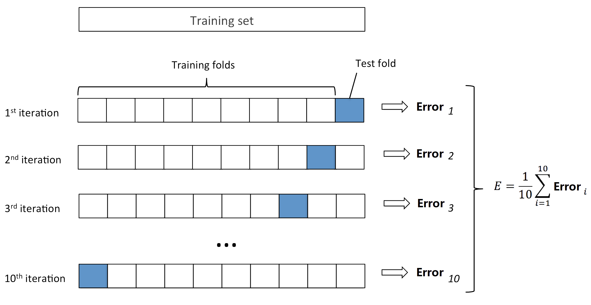

\def\cA{{\cal A}}
\def\cB{{\cal B}}
\def\cC{{\cal C}}
\def\cD{{\cal D}}
\def\cE{{\cal E}}
\def\cF{{\cal F}}
\def\cG{{\cal G}}
\def\cH{{\cal H}}
\def\cI{{\cal I}}
\def\cJ{{\cal J}}
\def\cK{{\cal K}}
\def\cL{{\cal L}}
\def\cM{{\cal M}}
\def\cN{{\cal N}}
\def\cO{{\cal O}}
\def\cP{{\cal P}}
\def\cQ{{\cal Q}}
\def\cR{{\cal R}}
\def\cS{{\cal S}}
\def\cT{{\cal T}}
\def\cU{{\cal U}}
\def\cV{{\cal V}}
\def\cW{{\cal W}}
\def\cX{{\cal X}}
\def\cY{{\cal Y}}
\def\cZ{{\cal Z}}

\def\bA{\mathbf{A}}
\def\bB{\mathbf{B}}
\def\bC{\mathbf{C}}
\def\bD{\mathbf{D}}
\def\bE{\mathbf{E}}
\def\bF{\mathbf{F}}
\def\bG{\mathbf{G}}
\def\bH{\mathbf{H}}
\def\bI{\mathbf{I}}
\def\bJ{\mathbf{J}}
\def\bK{\mathbf{K}}
\def\bL{\mathbf{L}}
\def\bM{\mathbf{M}}
\def\bN{\mathbf{N}}
\def\bO{\mathbf{O}}
\def\bP{\mathbf{P}}
\def\bQ{\mathbf{Q}}
\def\bR{\mathbf{R}}
\def\bS{\mathbf{S}}
\def\bT{\mathbf{T}}
\def\bU{\mathbf{U}}
\def\bV{\mathbf{V}}
\def\bW{\mathbf{W}}
\def\bX{\mathbf{X}}
\def\bY{\mathbf{Y}}
\def\bZ{\mathbf{Z}}

\def\ba{\mathbf{a}}
\def\bb{\mathbf{b}}
\def\bc{\mathbf{c}}
\def\bd{\mathbf{d}}
\def\be{\mathbf{e}}
<!-- Conflict \def\bf{\mathbf{f}} -->
\def\bg{\mathbf{g}}
\def\bh{\mathbf{h}}
\def\bi{\mathbf{i}}
\def\bj{\mathbf{j}}
\def\bk{\mathbf{k}}
\def\bl{\mathbf{l}}
\def\bm{\mathbf{m}}
\def\bn{\mathbf{n}}
\def\bo{\mathbf{o}}
\def\bp{\mathbf{p}}
\def\bq{\mathbf{q}}
\def\br{\mathbf{r}}
\def\bs{\mathbf{s}}
\def\bt{\mathbf{t}}
\def\bu{\mathbf{u}}
\def\bv{\mathbf{v}}
\def\bw{\mathbf{w}}
\def\bx{\mathbf{x}}
\def\by{\mathbf{y}}
\def\bz{\mathbf{z}}

\def\bzero{\mathbf{0}}
\def\balpha{\boldsymbol{\alpha}}
\def\bbeta{\boldsymbol{\beta}}
\def\btheta{\boldsymbol{\theta}}
\def\bxi{\boldsymbol{\xi}}
\def\bmu{\boldsymbol{\mu}}
\def\bepsilon{\boldsymbol{\epsilon}}

\def\T{\text{T}}
\def\Trace{\text{Trace}}
\def\Cov{\text{Cov}}
\def\Var{\text{Var}}
\def\E{\text{E}}
\def\pr{\text{pr}}
\def\Prob{\text{P}}
\def\argmin{\arg\min}
\def\argmax{\arg\max}

```{r include = FALSE}
  options(width = 100)
  knitr::opts_knit$set(global.par = TRUE)
  knitr::opts_chunk$set(collapse = TRUE, fig.dim = c(6, 6),
                        out.width = "45%", fig.align = 'center')
```
```{r include = FALSE}
  par(bg="transparent")
  par(mar=c(2,2,2,2))
```

# Ridge Regression

Ridge regression was proposed by @hoerl1970ridge, but is also a special case of Tikhonov regularization. The essential idea is very simple: Knowing that the ordinary least squares (OLS) solution is not unique in an ill-posed problem, i.e., $\bX^\T \bX$ is not invertible, a ridge regression adds a ridge (diagonal matrix) on $\bX^\T \bX$:

$$\widehat{\bbeta}^\text{ridge} = (\bX^\T \bX + n \lambda \bI)^{-1} \bX^\T \by,$$
It provides a solution of linear regression when multicollinearity happens, especially when the number of variables is larger than the sample size. Alternatively, this is also the solution of a regularized least square estimator. We add an $\ell_2$ penalty to the residual sum of squares, i.e., 

$$
\begin{align}
\widehat{\bbeta}^\text{ridge} =& \argmin_{\bbeta} (\by - \bX \bbeta)^\T (\by - \bX \bbeta) + n \lambda \lVert\bbeta\rVert_2^2\\
=& \argmin_{\bbeta} \frac{1}{n} \sum_{i=1}^n (y_i - x_i^\T \bbeta)^2 + \lambda \sum_{j=1}^p \beta_j^2,
\end{align}
$$

for some penalty $\lambda > 0$. Another approach that leads to the ridge regression is a constraint on the $\ell_2$  norm of the parameters, which will be introduced in the next Chapter. Ridge regression is used extensively in genetic analyses to address "small-$n$-large-$p$" problems. We will start with a motivation example and then discuss the bias-variance trade-off issue. 

## Motivation: Correlated Variables and Convexity

Ridge regression has many advantages. Most notably, it can address highly correlated variables. From an optimization point of view, having highly correlated variables means that the objective function ($\ell_2$ loss) becomes "flat" along certain directions in the parameter domain. This can be seen from the following example, where the true parameters are both $1$ while the estimated parameters concludes almost all effects to the first variable. You can change different seed to observe the variability of these parameter estimates and notice that they are quite large. Instead, if we fit a ridge regression, the parameter estimates are relatively stable.  

```{r}
  library(MASS)
  set.seed(2)
  n = 30
  
  # create highly correlated variables and a linear model
  X = mvrnorm(n, c(0, 0), matrix(c(1,0.99, 0.99, 1), 2,2))
  y = rnorm(n, mean = X[,1] + X[,2])
  
  # compare parameter estimates
  summary(lm(y~X-1))$coef
  
  # note that the true parameters are all 1's
  # Be careful that the `lambda` parameter in lm.ridge is our (n*lambda)
  lm.ridge(y~X-1, lambda=5)
```

The variance of both $\beta_1$ and $\beta_2$ are quite large. This is expected because we know from linear regression that the variance of $\widehat{\bbeta}$ is $\sigma^2 (\bX^\T \bX)^{-1}$. However, since the columns of $\bX$ are highly correlated, the smallest eigenvalue of $\bX^\T \bX$ is close to 0, making the largest eigenvalue of $(\bX^\T \bX)^{-1}$ very large. This can also be interpreted through an optimization point of view. The objective function for an OLS estimator is demonstrated in the following.

```{r}
  beta1 <- seq(0, 3, 0.005)
  beta2 <- seq(-1, 2, 0.005)
  allbeta <- data.matrix(expand.grid(beta1, beta2))
  rss <- matrix(apply(allbeta, 1, function(b, X, y) sum((y - X %*% b)^2), X, y), 
                length(beta1), length(beta2))
  
  # quantile levels for drawing contour
  quanlvl = c(0.01, 0.025, 0.05, 0.2, 0.5, 0.75)
  
  # plot the contour
  contour(beta1, beta2, rss, levels = quantile(rss, quanlvl))
  box()
  
  # the truth
  points(1, 1, pch = 19, col = "red", cex = 2)
  
  # the data 
  betahat <- coef(lm(y~X-1))
  points(betahat[1], betahat[2], pch = 19, col = "blue", cex = 2)
```

Over many simulation runs, the solution lies around the line of $\beta_1 + \beta_2 = 2$.

```{r}
  # the truth
  plot(NA, NA, xlim = c(-1, 3), ylim = c(-1, 3))
  points(1, 1, pch = 19, col = "red", cex = 2)
  
  # generate many datasets in a simulation 
  for (i in 1:200)
  {
    X = mvrnorm(n, c(0, 0), matrix(c(1,0.99, 0.99, 1), 2,2))
    y = rnorm(n, mean = X[,1] + X[,2])
    
    betahat <- solve(t(X) %*% X) %*% t(X) %*% y
    points(betahat[1], betahat[2], pch = 19, col = "blue", cex = 0.5)
  }
```

## Ridge Penalty and the Reduced Variation

If we add a ridge regression penalty, the contour is forced to be more convex due to the added eigenvalues on $\bX^\bX$, making the eignvalues of $(\bX^\bX)^{-1}$ smaller. Here is a plot of the Ridge $\ell_2$ penalty.

```{r echo = FALSE}
  pen <- matrix(apply(allbeta, 1, function(b) 3*b %*% b),
                length(beta1), length(beta2))
  
  contour(beta1, beta2, pen, levels = quantile(pen, quanlvl))
  points(1, 1, pch = 19, col = "red", cex = 2)
  box()
```

Hence, by adding this to the OLS objective function, the solution is more stable. This may be interpreted in several different ways such as: 1) the objective function is more convex; 2) the variance of the estimator is smaller. However, this causes some bias too. Choosing the tuning parameter is a balance of the bias-variance trade-off, which will be discussed in the following. 

```{r fig.dim = c(12, 6), out.width = '90%'}
    par(mfrow=c(1, 2))

    # adding a L2 penalty to the objective function
    rss <- matrix(apply(allbeta, 1, function(b, X, y) sum((y - X %*% b)^2) + b %*% b, X, y),
                  length(beta1), length(beta2))
    
    # the ridge solution
    bh = solve(t(X) %*% X + diag(2)) %*% t(X) %*% y
    
    contour(beta1, beta2, rss, levels = quantile(rss, quanlvl))
    points(1, 1, pch = 19, col = "red", cex = 2)
    points(bh[1], bh[2], pch = 19, col = "blue", cex = 2)
    box()
    
    # adding a larger penalty
    rss <- matrix(apply(allbeta, 1, function(b, X, y) sum((y - X %*% b)^2) + 10*b %*% b, X, y),
                  length(beta1), length(beta2))
    
    bh = solve(t(X) %*% X + 10*diag(2)) %*% t(X) %*% y
    
    # the ridge solution
    contour(beta1, beta2, rss, levels = quantile(rss, quanlvl))
    points(1, 1, pch = 19, col = "red", cex = 2)
    points(bh[1], bh[2], pch = 19, col = "blue", cex = 2)
    box()
```

We can check the ridge solution over many simulation runs 

```{r fig.dim=c(6, 6), out.width = '45%'}
  par(mfrow=c(1, 1))

  # the truth
  plot(NA, NA, xlim = c(-1, 3), ylim = c(-1, 3))
  points(1, 1, pch = 19, col = "red", cex = 2)
  
  # generate many datasets in a simulation 
  for (i in 1:200)
  {
    X = mvrnorm(n, c(0, 0), matrix(c(1,0.99, 0.99, 1), 2,2))
    y = rnorm(n, mean = X[,1] + X[,2])
    
    # betahat <- solve(t(X) %*% X + 2*diag(2)) %*% t(X) %*% y
    betahat <- lm.ridge(y ~ X - 1, lambda = 2)$coef
    points(betahat[1], betahat[2], pch = 19, col = "blue", cex = 0.5)
  }
```

This effect is gradually changing as we increase the penalty level. The following simulation shows how the variation of $\bbeta$ changes. We show this with two penalty values, and see how the estimated parameters are away from the truth. 

```{r out.width = "80%", fig.dim=c(12, 6)}
  par(mfrow = c(1, 2))

  # small penalty
  plot(NA, NA, xlim = c(-1, 3), ylim = c(-1, 3))
  points(1, 1, pch = 19, col = "red", cex = 2)
  
  # generate many datasets in a simulation 
  for (i in 1:200)
  {
    X = mvrnorm(n, c(0, 0), matrix(c(1,0.99, 0.99, 1), 2,2))
    y = rnorm(n, mean = X[,1] + X[,2])
    
    betahat <- lm.ridge(y ~ X - 1, lambda = 2)$coef
    points(betahat[1], betahat[2], pch = 19, col = "blue", cex = 0.5)
  }
  
  # large penalty
  plot(NA, NA, xlim = c(-1, 3), ylim = c(-1, 3))
  points(1, 1, pch = 19, col = "red", cex = 2) 
  
  # generate many datasets in a simulation 
  for (i in 1:200)
  {
    X = mvrnorm(n, c(0, 0), matrix(c(1,0.99, 0.99, 1), 2,2))
    y = rnorm(n, mean = X[,1] + X[,2])
    
    # betahat <- solve(t(X) %*% X + 30*diag(2)) %*% t(X) %*% y
    betahat <- lm.ridge(y ~ X - 1, lambda = 30)$coef
    points(betahat[1], betahat[2], pch = 19, col = "blue", cex = 0.5)
  }
```


## Bias and Variance of Ridge Regression

We can set a relationship between Ridge and OLS, assuming that the OLS estimator exist. 

\begin{align}
\widehat{\bbeta}^\text{ridge} =& (\bX^\T \bX + n\lambda \bI)^{-1} \bX^\T \by \\
=& (\bX^\T \bX + n\lambda \bI)^{-1} (\bX^\T \bX) \color{OrangeRed}{(\bX^\T \bX)^{-1} \bX^\T \by}\\
=& (\bX^\T \bX + n\lambda \bI)^{-1} (\bX^\T \bX) \color{OrangeRed}{\widehat{\bbeta}^\text{ols}}
\end{align}

This leads to a biased estimator (since the OLS estimator is unbiased) if we use any nonzero $\lambda$. 

  * As $\lambda \rightarrow 0$, the ridge solution is eventually the same as OLS
  * As $\lambda \rightarrow \infty$, $\widehat{\bbeta}^\text{ridge} \rightarrow 0$

It can be easier to analyze a case with $\bX^\T \bX = n \bI$, i.e, with standardized and orthogonal columns in $\bX$. Note that in this case, each $\beta_j^{\text{ols}}$ is just the projection of $\by$ onto $\bx_j$, the $j$th column of the design matrix. We also have 

\begin{align}
\widehat{\bbeta}^\text{ridge} =& (\bX^\T \bX + n\lambda \bI)^{-1} (\bX^\T \bX) \widehat{\bbeta}^\text{ols}\\
=& (\bI + \lambda \bI)^{-1}\widehat{\bbeta}^\text{ols}\\
=& (1 + \lambda)^{-1} \widehat{\bbeta}^\text{ols}\\

\Longrightarrow \widehat{\beta}_j^{\text{ridge}} =& \frac{1}{1 + \lambda} \widehat{\beta}_j^\text{ols}
\end{align}

Then in this case, the bias and variance of the ridge estimator can be explicitly expressed. Here for the bias term, we assume that the OLS estimator is unbiased, i.e., $\E(\widehat{\beta}_j^\text{ols}) = \beta_j$. Then

  * $\text{Bias}(\widehat{\beta}_j^{\text{ridge}}) = E[\widehat{\beta}_j^{\text{ridge}} - \beta_j] = \frac{-\lambda}{1 + \lambda} \beta_j$ (not zero)
  * $\text{Var}(\widehat{\beta}_j^{\text{ridge}}) = \frac{1}{(1 + \lambda)^2} \text{Var}(\widehat{\beta}_j^\text{ols})$ (reduced from OLS)

Of course, we can ask the question: is it worth it? We could proceed with a simple analysis of the MSE of $\beta$ (dropping $j$ for simplicity). Note that this is also the MSE for predicting the expected value of a subject ($x^\T \beta$) with covariate $x = 1$.

\begin{align}
\text{MSE}(\beta) &= \E(\widehat{\beta} - \beta)^2 \\
&= \E[\widehat{\beta} - \E(\widehat{\beta})]^2 + \E[\widehat{\beta} - \beta]^2 \\
&= \E[\widehat{\beta} - \E(\widehat{\beta})]^2 + 0 + [\E(\widehat{\beta}) - \beta]^2 \\
&= \Var(\widehat{\beta}) + \text{Bias}^2.
\end{align}

This bias-variance breakdown formula will appear multiple times in later lectures. Now, plugging in the results developed earlier based on the orthogonal design matrix, and investigate the derivative of the MSE of the Ridge estimator, we have 

\begin{align}
\frac{\partial \text{MSE}(\widehat{\beta}^\text{ridge})}{ \partial \lambda} =& \frac{\partial}{\partial \lambda} \left[ \frac{1}{(1+\lambda)^2} \Var(\widehat{\beta}^\text{ols}) + \frac{\lambda^2}{(1 + \lambda)^2} \beta^2 \right] \\
=& \frac{2}{(1+\lambda)^3} \left[ \lambda \beta^2 - \Var(\widehat{\beta}^\text{ols}) \right]
\end{align}

Note that when the derivative is negative, increasing $\lambda$ would decrease the MSE. This implies that we can reduce the MSE by choosing a small $\lambda$. However, we are not able to know the best choice of $\lambda$ since the true $\beta$ is unknown. One the other hand, the situation is much more involving when the columns in $\bX$ are not orthogonal. The following analysis helps to understand a non-orthogonal case. It is essentially re-organizing the columns of $\bX$ into its principal components so that they are still orthogonal. 

Let's first take a singular value decomposition (SVD) of $\bX$, with $\bX = \bU \bD \bV^\T$, then the columns in $\bU$ form an orthogonal basis and columns in $\bU \bD$ are the __principal components__ and $\bV$ defines the principal directions. In addition, we have $n \widehat{\boldsymbol \Sigma} = \bX^\T \bX = \bV \bD^2 \bV^\T$. Assuming that $p < n$, and $\bX$ has full column ranks, then the Ridge estimator fitted $\by$ value can be decomposed as

\begin{align}
\widehat{\by}^\text{ridge} =& \bX \widehat{\beta}^\text{ridge} \\ 
=& \bX (\bX^\T \bX + n \lambda)^{-1} \bX^\T \by \\
=& \bU \bD \bV^\T ( \bV \bD^2 \bV^\T + n \lambda \bV \bV^\T)^{-1} \bV \bD \bU^\T \by \\
=& \bU \bD^2 (n \lambda + \bD^2)^{-1} \bU^\T \by \\
=& \sum_{j = 1}^p \bu_j \left( \frac{d_j^2}{n \lambda + d_j^2} \bu_j^\T \by \right),
\end{align}

where $d_j$ is the $j$th eigenvalue of the PCA. Hence, the Ridge regression fitted value can be understood as 

  * Perform PCA of $\bX$
  * Project $\by$ onto the PCs
  * Shrink the projection $\bu_j^\T \by$ by the factor $d_j^2 / (n \lambda + d_j^2)$
  * Reassemble the PCs using all the shrunken length

Hence, the bias-variance notion can be understood as the trade-off on these derived directions $\bu_j$ and their corresponding parameters $\bu_j^\T \by$.

## Degrees of Freedom

We know that for a linear model, the degrees of freedom (DF) is simply the number of parameters used. There is a formal definition, using 

\begin{align}
\text{DF}(\widehat{f}) =& \frac{1}{\sigma^2} \sum_{i = 1}^n \Cov(\widehat{y}_i, y_i)\\
=& \frac{1}{\sigma^2} \Trace[\Cov(\widehat{\by}, \by)]
\end{align}

We can check that for a linear regression (assuming the intercept is already included in $\bX$), the DF is 

\begin{align}
\frac{1}{\sigma^2} \Trace[\Cov(\widehat{\by}^\text{ols}, \by)] =& \frac{1}{\sigma^2} \Trace[\Cov(\bX(\bX^\T\bX)^{-1} \bX^\T \by, \by)] \\
=& \Trace(\bX(\bX^\T\bX)^{-1} \bX^\T) \\
=& \Trace(\bI_{p\times p})\\
=& p
\end{align}

For the Ridge regression, we can perform the same analysis on ridge regression. 

\begin{align}
\frac{1}{\sigma^2} \Trace[\Cov(\widehat{\by}^\text{ridge}, \by)] =& \frac{1}{\sigma^2} \Trace[\Cov(\bX(\bX^\T\bX + n \lambda \bI)^{-1} \bX^\T \by, \by)] \\
=& \Trace(\bX(\bX^\T\bX + n \lambda \bI)^{-1} \bX^\T) \\
=& \Trace(\bU \bD \bV^\T ( \bV \bD^2 \bV^\T + n \lambda \bV \bV^\T)^{-1} \bV \bD \bU^\T)\\
=& \sum_{j = 1}^p \frac{d_j^2}{d_j^2 + n\lambda}
\end{align}

Note that this is smaller than $p$ as long as $\lambda \neq 0$. This implies that the Ridge regression does not use the full potential of all $p$ variables, since there is a risk of over-fitting. 

## Using the `lm.ridge()` function

We have seen how the `lm.ridge()` can be used to fit a Ridge regression. However, keep in mind that the `lambda` parameter used in the function actually specifies the $n \lambda$ entirely we used in our notation. However, regardless, our goal is mainly to tune this parameter to achieve a good balance of bias-variance trade off. However, the difficulty here is to evaluate the performance without knowing the truth. Let's first use a simulated example, in which we do know the truth and then introduce the cross-validation approach for real data where we do not know the truth. 

We use the prostate cancer data `prostate` from the `ElemStatLearn` package. The dataset contains 8 explanatory variables and one outcome `lpsa`, the log prostate-specific antigen value. 

```{r}
  # ElemStatLearn is currently archived, install a previous version
  # library(devtools)
  # install_version("ElemStatLearn", version = "2015.6.26", repos = "http://cran.r-project.org")
  library(ElemStatLearn)
  head(prostate)
```

### Scaling Issue

We can use `lm.ridge()` with a fixed $\lambda$ value, as we have shown in the previous example. Its syntax is again similar to the `lm()` function, with an additional argument `lambda`. We can also compare that with our own code. 

```{r}
  # lm.ridge function from the MASS package
  lm.ridge(lpsa ~., data = prostate[, 1:9], lambda = 1)

  # using our own code
  X = cbind(1, data.matrix(prostate[, 1:8]))
  y = prostate[, 9]
  solve(t(X) %*% X + diag(9)) %*% t(X) %*% y
```
However, they look different. This is because ridge regression has a scaling issue: it would shrink parameters differently if the corresponding covariates have different scales. This can be seen from our previous development of the SVD analysis. Since the shrinkage is the same for all $d_j$s, it would apply a larger shrinkage for small $d_j$. A commonly used approach to deal with the scaling issue is to __standardize  all covariates__ such that they are treated the same way. In addition, we will also __center both $\bX$ and $\by$__ before performing the ridge regression. An interesting consequence of centering is that we do not need the intercept anymore, since $\bX \bbeta = \mathbf{0}$ for all $\bbeta$. One last point is that when performing scaling, `lm.ridge()` use the $n$ factor instead of $n-1$ when calculating the standard deviation. Hence, incorporating all these, we have 

```{r}
  # perform centering and scaling
  X = scale(data.matrix(prostate[, 1:8]), center = TRUE, scale = TRUE)

  # use n instead of (n-1) for standardization
  n = nrow(X)
  X = X * sqrt(n / (n-1))
  
  # center y but not scaling
  y = scale(prostate[, 9], center = TRUE, scale = FALSE)
  
  # getting the estimated parameter
  mybeta = solve(t(X) %*% X + diag(8)) %*% t(X) %*% y
  ridge.fit = lm.ridge(lpsa ~., data = prostate[, 1:9], lambda = 1)
  
  # note that $coef obtains the coefficients internally from lm.ridge
  # however coef() would transform these back to the original scale version
  cbind(mybeta, ridge.fit$coef)
```

### Multiple $\lambda$ values

Since we now face the problem of bias-variance trade-off, we can fit the model with multiple $\lambda$ values and select the best. This can be done using the following code. 

```{r}
  library(MASS)
  fit = lm.ridge(lpsa~.,  data = prostate[, -10], lambda = seq(0, 100, by=0.2))
```

For each $\lambda$, the coefficients of all variables are recorded. The plot shows how these coefficients change as a function of $\lambda$. We can easily see that as $\lambda$ becomes larger, the coefficients are shrunken towards 0. This is consistent with our understanding of the bias. On the very left hand size of the plot, the value of each parameter corresponds to the OLS result since no penalty is applied. Be careful that the coefficients of the fitted objects `fit$coef` are scaled by the standard deviation of the covariates. If you need the original scale, make sure to use `coef(fit)`.

```{r echo = FALSE}
  par(mfrow=c(1,1))
```

```{r fig.dim=c(6, 6), out.width = '45%'}
    matplot(coef(fit)[, -1], type = "l", xlab = "Lambda", ylab = "Coefficients")
    text(rep(50, 8), coef(fit)[1,-1], colnames(prostate)[1:8])
    title("Prostate Cancer Data: Ridge Coefficients")
```

To select the best $\lambda$ value, there can be several different methods. We will discuss two approaches among them: $k$-fold cross-validation and generalized cross-validation (GCV).

## Cross-validation

Cross-validation (CV) is a technique to evaluate the performance of a model on an independent set of data. The essential idea is to separate out a subset of the data and do not use that part during the training, while using it for testing. We can then rotate to or sample a different subset as the testing data. Different cross-validation methods differs on the mechanisms of generating such testing data. __$K$-fold cross-validation__ is probably the the most popular among them. The method works in the following steps:

  1. Randomly split the data into $K$ equal portions 
  2. For each $k$ in $1, \ldots, K$: use the $k$th portion as the testing data and the rest as training data, obtain the testing error
  3. Average all $K$ testing errors

Here is a graphical demonstration of a $10$-fold CV:

<center>
{width=80%}
</center>

There are also many other cross-validation procedures, for example, the __Monte Carlo cross-validation__ randomly splits the data into training and testing (instead of fix $K$ portions) each time and repeat the process as many times as we like. The benefit of such procedure is that if this is repeated enough times, the estimated testing error becomes fairly stable, and not affected much by the random mechanism. On the other hand, we can also repeat the entire $K$-fold CV process many times, then average the errors. This is also trying to reduced the influence of randomness. 

## Leave-one-out cross-validation

Regarding the randomness, the leave-one-out cross-validation is completely nonrandom. It is essentially the $k$-fold CV approach, but with $k$ equal to $n$, the sample size. A standard approach would require to re-fit the model $n$ times, however, some linear algebra can show that there is an equivalent form using the "Hat" matrix when fitting a linear regression:

\begin{align}
\text{CV}(n) =& \frac{1}{n}\sum_{i=1}^n (y_i - \widehat{y}_{[i]})^2\\
=& \frac{1}{n} \sum_{i=1}^n \left( \frac{y_i - \widehat{y}_i}{1 - \bH_{ii}} \right)^2,
\end{align}
where $\widehat{y}_{i}$ is the fitted value using the whole dataset, but $\widehat{y}_{[i]}$ is the prediction of $i$th observation using the data without it when fitting the model. And $\bH_{ii}$ is the $i$th diagonal element of the hat matrix $\bH = \bX(\bX^\T \bX)^{-1} \bX$. The proof is essentially an application of the [Sherman–Morrison–Woodbury (SMW)](https://en.wikipedia.org/wiki/Sherman%E2%80%93Morrison_formula) formula, which is also used when deriving the rank-one update of a quasi-Newton optimization approach. 

```{proof}
Denote $\bX_{[i]}$ and $\by_{[i]}$ the data derived from $\bX$ and $\by$, but with the $i$ observation ($x_i$, $y_i$) removed. We then have the properties that

$$\bX_{[i]}^\T \bX_{[i]} = \bX^\T \bX - x_i x_i^\T, $$

and 

$$\bH_{ii} = x_i^\T (\bX^\T \bX)^{-1} x_i.$$

By the SMW formula, we have 

$$(\bX_{[i]}^\T \bX_{[i]})^{-1} = (\bX^\T \bX)^{-1} + \frac{(\bX^\T \bX)^{-1}x_i x_i^\T (\bX^\T \bX)^{-1}}{ 1 - \bH_{ii}}, $$

Further notice that 

$$\bX_{[i]}^\T \by_{[i]} = \bX^\T \by - x_i y_i, $$

we can then reconstruct the fitted parameter when observation $i$ is removed:
  
\begin{align}
\widehat{\bbeta}_{[i]} =& (\bX_{[i]}^\T \bX_{[i]})^{-1} \bX_{[i]}^\T \by_{[i]} \\
=& \left[ (\bX^\T \bX)^{-1} + \frac{(\bX^\T \bX)^{-1}x_i x_i^\T (\bX^\T \bX)^{-1}}{ 1 - \bH_{ii}} \right] (\bX^\T \by - x_i y_i)\\
=& (\bX^\T \bX)^{-1} \bX^\T \by + \left[ - (\bX^\T \bX)^{-1} x_i y_i +  \frac{(\bX^\T \bX)^{-1}x_i x_i^\T (\bX^\T \bX)^{-1}}{ 1 - \bH_{ii}} (\bX^\T \by - x_i y_i) \right] \\
=& \widehat{\bbeta} - \frac{(\bX^\T \bX)^{-1} x_i}{1 - \bH_{ii}} \left[ y_i (1 - \bH_{ii}) - x_i^\T \widehat{\bbeta} + \bH_{ii} y_i \right]\\
=& \widehat{\bbeta} - \frac{(\bX^\T \bX)^{-1} x_i}{1 - \bH_{ii}} \left( y_i - x_i^\T \widehat{\bbeta} \right)
\end{align}

Then the error of the $i$th obervation from the leave-one-out model is 

\begin{align}
y _i - \widehat{y}_{[i]} =& y _i - x_i^\T \widehat{\bbeta}_{[i]} \\
=& y _i - x_i^\T \left[ \widehat{\bbeta} - \frac{(\bX^\T \bX)^{-1} x_i}{1 - \bH_{ii}} \left( y_i - x_i^\T \widehat{\bbeta} \right)  \right]\\
=& y _i - x_i^\T \widehat{\bbeta} + \frac{x_i^\T (\bX^\T \bX)^{-1} x_i}{1 - \bH_{ii}} \left( y_i - x_i^\T \widehat{\bbeta} \right)\\
=& y _i - x_i^\T \widehat{\bbeta} + \frac{\bH_{ii}}{1 - \bH_{ii}} \left( y_i - x_i^\T \widehat{\bbeta} \right)\\
=& \frac{y_i - x_i^\T \widehat{\bbeta}}{1 - \bH_{ii}}
\end{align}

This completes the proof. 
```

### Generalized cross-validation 
 
The generalized cross-validation (GCV, @golub1979generalized) is a modified version of the leave-one-out CV:

$$\text{GCV}(\lambda) = \frac{\sum_{i=1}^n (y_i - x_i^\T \widehat{\bbeta}^\text{ridge}_\lambda)}{(n - \Trace(\bS_\lambda))}$$
where $\bS_\lambda$ is the hat matrix corresponding to the ridge regression:

$$\bS_\lambda = \bX (\bX^\T \bX + \lambda \bI)^{-1} \bX^\T$$

The following plot shows how GCV value changes as a function of $\lambda$. 

```{r}
    # use GCV to select the best lambda
    plot(fit$lambda[1:500], fit$GCV[1:500], type = "l", col = "darkorange", 
         ylab = "GCV", xlab = "Lambda", lwd = 3)
    title("Prostate Cancer Data: GCV")
```

We can select the best $\lambda$ that produces the smallest GCV. 

```{r}
    fit$lambda[which.min(fit$GCV)]
    round(coef(fit)[which.min(fit$GCV), ], 4)
```

## The `glmnet` package

The `glmnet` package implements the $k$-fold cross-validation. To perform a ridge regression with cross-validation, we need to use the `cv.glmnet()` function with $alpha = 0$. Here, the $\alpha$ is a parameter that controls the $\ell_2$ and $\ell_1$ (Lasso) penalties. In addition, the lambda values are also automatically selected, on the log-scale. 

```{r}
  library(glmnet)
  set.seed(3)
  fit2 = cv.glmnet(data.matrix(prostate[, 1:8]), prostate$lpsa, nfolds = 10, alpha = 0)
  plot(fit2$glmnet.fit, "lambda")
```

It is useful to plot the cross-validation error against the $\lambda$ values , then select the corresponding $\lambda$ with the smallest error. The corresponding coefficient values can be obtained using the `s = "lambda.min"` option in the `coef()` function. However, this can still be subject to over-fitting, and sometimes practitioners use `s = "lambda.1se"` to select a slightly heavier penalized version based on the variations observed from different folds. 

```{r}
  plot(fit2)
  coef(fit2, s = "lambda.min")
  coef(fit2, s = "lambda.1se")
```

### Scaling Issue

The `glmnet` package would using the same strategies for scaling: center and standardize $\bX$ and center $\by$. A slight difference is that it considers using $1/(2n)$ as the normalizing factor of the residual sum of squares, but also uses $\lambda/2 \lVert \bbeta\rVert_2^2$ as the penalty. This does not affect our formulation since the $1/2$ cancels out. However, it would slightly affect the Lasso formulation introduced in the next Chapter since the $\ell_1$ penalty does not apply this $1/2$ factor. Nonetheless, we can check the (nearly) equivalence between `lm.ridge` and `glmnet()`:

```{r fig.dim = c(12, 6), out.width = "70%"}
  n = 100
  p = 5

  X <- as.matrix(scale(matrix(rnorm(n*p), n, p)))
  y <- as.matrix(scale(X[, 1] + X[,2]*0.5 + rnorm(n, sd = 0.5)))
 
  lam = 10^seq(-1, 3, 0.1)
 
  fit1 <- lm.ridge(y ~ X, lambda = lam)
  fit2 <- glmnet(X, y, alpha = 0, lambda = lam / nrow(X))
 
  # the estimated parameters
  par(mfrow=c(1, 2))
  matplot(apply(coef(fit1), 2, rev), type = "l", main = "lm.ridge")
  matplot(t(as.matrix(coef(fit2))), type = "l", main = "glmnet")
  
  # Check differences
  max(abs(apply(coef(fit1), 2, rev) - t(as.matrix(coef(fit2)))))
```


