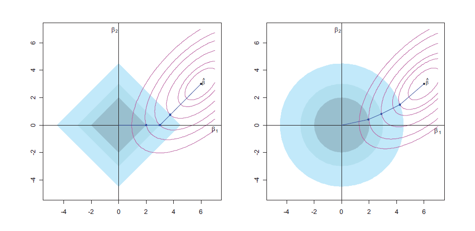

\def\cA{{\cal A}}
\def\cB{{\cal B}}
\def\cC{{\cal C}}
\def\cD{{\cal D}}
\def\cE{{\cal E}}
\def\cF{{\cal F}}
\def\cG{{\cal G}}
\def\cH{{\cal H}}
\def\cI{{\cal I}}
\def\cJ{{\cal J}}
\def\cK{{\cal K}}
\def\cL{{\cal L}}
\def\cM{{\cal M}}
\def\cN{{\cal N}}
\def\cO{{\cal O}}
\def\cP{{\cal P}}
\def\cQ{{\cal Q}}
\def\cR{{\cal R}}
\def\cS{{\cal S}}
\def\cT{{\cal T}}
\def\cU{{\cal U}}
\def\cV{{\cal V}}
\def\cW{{\cal W}}
\def\cX{{\cal X}}
\def\cY{{\cal Y}}
\def\cZ{{\cal Z}}

\def\bA{\mathbf{A}}
\def\bB{\mathbf{B}}
\def\bC{\mathbf{C}}
\def\bD{\mathbf{D}}
\def\bE{\mathbf{E}}
\def\bF{\mathbf{F}}
\def\bG{\mathbf{G}}
\def\bH{\mathbf{H}}
\def\bI{\mathbf{I}}
\def\bJ{\mathbf{J}}
\def\bK{\mathbf{K}}
\def\bL{\mathbf{L}}
\def\bM{\mathbf{M}}
\def\bN{\mathbf{N}}
\def\bO{\mathbf{O}}
\def\bP{\mathbf{P}}
\def\bQ{\mathbf{Q}}
\def\bR{\mathbf{R}}
\def\bS{\mathbf{S}}
\def\bT{\mathbf{T}}
\def\bU{\mathbf{U}}
\def\bV{\mathbf{V}}
\def\bW{\mathbf{W}}
\def\bX{\mathbf{X}}
\def\bY{\mathbf{Y}}
\def\bZ{\mathbf{Z}}

\def\ba{\mathbf{a}}
\def\bb{\mathbf{b}}
\def\bc{\mathbf{c}}
\def\bd{\mathbf{d}}
\def\be{\mathbf{e}}
<!-- Conflict \def\bf{\mathbf{f}} -->
\def\bg{\mathbf{g}}
\def\bh{\mathbf{h}}
\def\bi{\mathbf{i}}
\def\bj{\mathbf{j}}
\def\bk{\mathbf{k}}
\def\bl{\mathbf{l}}
\def\bm{\mathbf{m}}
\def\bn{\mathbf{n}}
\def\bo{\mathbf{o}}
\def\bp{\mathbf{p}}
\def\bq{\mathbf{q}}
\def\br{\mathbf{r}}
\def\bs{\mathbf{s}}
\def\bt{\mathbf{t}}
\def\bu{\mathbf{u}}
\def\bv{\mathbf{v}}
\def\bw{\mathbf{w}}
\def\bx{\mathbf{x}}
\def\by{\mathbf{y}}
\def\bz{\mathbf{z}}

\def\bzero{\mathbf{0}}
\def\balpha{\boldsymbol{\alpha}}
\def\bbeta{\boldsymbol{\beta}}
\def\btheta{\boldsymbol{\theta}}
\def\bxi{\boldsymbol{\xi}}
\def\bmu{\boldsymbol{\mu}}
\def\bepsilon{\boldsymbol{\epsilon}}

\def\T{\text{T}}
\def\Trace{\text{Trace}}
\def\Cov{\text{Cov}}
\def\Var{\text{Var}}
\def\E{\text{E}}
\def\pr{\text{pr}}
\def\Prob{\text{P}}
\def\argmin{\arg\min}
\def\argmax{\arg\max}

```{r include = FALSE}
  options(width = 100)
  knitr::opts_knit$set(global.par = TRUE)
  knitr::opts_chunk$set(collapse = TRUE, fig.dim = c(6, 6),
                        out.width = "45%", fig.align = 'center')
```
```{r include = FALSE}
  par(bg="transparent")
  par(mar=c(2,2,2,2))
```

# Lasso

Lasso [@tibshirani1996regression] is among the most popular machine learning models. Different from the Ridge regression, its adds $\ell_1$ penalty on the fitted parameters:

\begin{align}
\widehat{\bbeta}^\text{lasso} =& \argmin_{\bbeta} (\by - \bX \bbeta)^\T (\by - \bX \bbeta) + n \lambda \lVert\bbeta\rVert_1\\
=& \argmin_{\bbeta} \frac{1}{n} \sum_{i=1}^n (y_i - x_i^\T \bbeta)^2 + \lambda \sum_{i=1}^p |\beta_j|,
\end{align}

The main advantage of adding such a penalty is that small $\widehat{\beta}_j$ values can be __shrunk to zero__. This may prevents over-fitting and also improve the interpretability especially when the number of variables is large. We will analyze the Lasso starting with a single variable case, and then discuss the application of coordinate descent algorithm to obtain the solution. 

## One-Variable Lasso and Shrinkage

To illustrate how Lasso shrink a parameter estimate to zero, let's consider an orthogonal design matrix case, i.e., $\bX^\T \bX = n \bI$, which will eventually reduce to a one-variable problem. Note that the intercept term is not essential because we can always pre-center the observed data $x_i$ and $y_i$s so that they can be recovered after this one variable problem. Our objective function is 

$$\frac{1}{n}\lVert \by - \bX \bbeta \rVert^2 + \lambda \lVert\bbeta\rVert_1$$
We are going to relate the solution the OLS solution, which exists in this case because $\bX^\T \bX$ is invertible. Hence, we have 

\begin{align}
&\frac{1}{n}\lVert \by - \bX \bbeta \rVert^2 + \lambda \lVert\bbeta\rVert_1\\
=&\frac{1}{n}\lVert \by - \color{OrangeRed}{\bX \widehat{\bbeta}^\text{ols} + \bX \widehat{\bbeta}^\text{ols}} - \bX \bbeta \rVert^2 + \lambda \lVert\bbeta\rVert_1\\
=&\frac{1}{n}\lVert \by - \bX \widehat{\bbeta}^\text{ols} \rVert^2 + \frac{1}{n} \lVert \bX \widehat{\bbeta}^\text{ols} - \bX \bbeta \rVert^2 + \lambda \lVert\bbeta\rVert_1
\end{align}

The cross-term is zero because the OLS residual term is orthogonal to the columns of $\bX$:

\begin{align}
&2(\by - \bX \widehat{\bbeta}^\text{ols})^\T (\bX \widehat{\bbeta}^\text{ols} - \bX \bbeta )\\
=& 2\br^\T \bX (\widehat{\bbeta}^\text{ols} - \bbeta )\\
=& 0
\end{align}

Then we just need to optimize the part that involves $\bbeta$:

\begin{align}
&\underset{\bbeta}{\argmin} \frac{1}{n}\lVert \by - \bX \widehat{\bbeta}^\text{ols} \rVert^2 + \frac{1}{n} \lVert \bX \widehat{\bbeta}^\text{ols} - \bX \bbeta \rVert^2 + \lambda \lVert\bbeta\rVert_1\\
=&\underset{\bbeta}{\argmin} \frac{1}{n} \lVert \bX \widehat{\bbeta}^\text{ols} - \bX \bbeta \rVert^2 + \lambda \lVert\bbeta\rVert_1\\
=&\underset{\bbeta}{\argmin} \frac{1}{n} (\widehat{\bbeta}^\text{ols} - \bbeta )^\T \bX^\T \bX (\widehat{\bbeta}^\text{ols} - \bbeta )  + \lambda \lVert\bbeta\rVert_1\\
=&\underset{\bbeta}{\argmin} \frac{1}{n} (\widehat{\bbeta}^\text{ols} - \bbeta )^\T n \bI (\widehat{\bbeta}^\text{ols} - \bbeta )  + \lambda \lVert\bbeta\rVert_1\\
=&\underset{\bbeta}{\argmin} \sum_{j = 1}^p (\widehat{\bbeta}^\text{ols}_j - \bbeta_j )^2 + \lambda \sum_j |\bbeta_j|\\
\end{align}

This is a separable problem meaning that we can solve each $\beta_j$ independently since they do not interfere each other. Then the univariate problem is 

$$\underset{\beta}{\argmin} \,\, (\beta - a)^2 + \lambda |\beta|$$
We learned that to solve for an optimizer, we can set the gradient to be zero. However, the function is not everywhere differentiable. Still, we can separate this into two cases: $\beta > 0$ and $\beta < 0$. For the positive side, we have 

\begin{align}
0 =& \frac{\partial}{\partial \beta} \,\, (\beta - a)^2 + \lambda |\beta| = 2 (\beta - a) + \lambda \\
\Longrightarrow \quad \beta =&\, a - \lambda/2
\end{align}

However, this will maintain positive only when $\beta$ is greater than $a - \lambda/2$. The negative size is similar. And whenever $\beta$ falls in between, it will be shrunk to zero. Overall, for our previous univariate optimization problem, the solution is  

\begin{align}
\hat\beta_j^\text{lasso} &=
        \begin{cases}
        \hat\beta_j^\text{ols} - \lambda/2 & \text{if} \quad \hat\beta_j^\text{ols} > \lambda/2 \\
        0 & \text{if} \quad |\hat\beta_j^\text{ols}| < \lambda/2 \\
        \hat\beta_j^\text{ols} + \lambda/2 & \text{if} \quad \hat\beta_j^\text{ols} < -\lambda/2 \\
        \end{cases}\\
        &= \text{sign}(\hat\beta_j^\text{ols}) \left(|\hat\beta_j^\text{ols}| - \lambda/2 \right)_+ \\
        &\doteq \text{SoftTH}(\hat\beta_j^\text{ols}, \lambda)
\end{align}

This is called a __soft-thresholding function__. This implies that when $\lambda$ is large enough, the estimated $\beta$ parameter of Lasso will be shrunk towards zero. The following animated figure demonstrates how adding an $\ell_1$ penalty can change the optimizer. The objective function is $0.5 + (\beta - 1)^2$ and based on our previous analysis, once the penalty is larger than 2, the optimizer would stay at 0. 

```{r fig.dim = c(8, 6), out.width = "100%", fig.align = 'center', message=FALSE, warning=FALSE, echo=FALSE}
  library(gganimate)
  library(plotly)
  
  b = seq(-0.5, 2, 0.01)
  fb = 0.5 + (b - 1)^2
  alllambda = seq(0, 2.5, 0.1)
  onevarlasso = data.frame()
  
  for (i in 1:length(alllambda))
  {
    lambdadata = rbind(data.frame("b" = b, "value" = fb, "Function" = "Loss", 
                             "Lambda" = alllambda[i], "bnum" = 1:length(b)), 
                       data.frame("b" = b, "value" = abs(b*alllambda[i]), "Function" = "Penalty", 
                             "Lambda" = alllambda[i], "bnum" = 1:length(b)),
                       data.frame("b" = b, "value" = fb + abs(b*alllambda[i]), "Function" = "Loss + Penalty", 
                             "Lambda" = alllambda[i], "bnum" = 1:length(b)))
    
    onevarlasso = rbind(onevarlasso, lambdadata)
  }
  
  
  p <- ggplot(data.frame(onevarlasso), aes(x = b, y = value, color = Function)) +
    geom_line(aes(frame = Lambda)) +
    scale_x_continuous(name = "Beta", limits = c(-0.5, 2)) +
    scale_y_continuous(name = "Function Value", limits = c(0, 4)) +
    scale_color_manual(values=c("#ff8c00", "#000000", "#00bfff")) +
    theme(
      panel.background = element_rect(fill = "transparent"), # bg of the panel
      plot.background = element_rect(fill = "transparent", color = NA), # bg of the plot
      legend.background = element_rect(fill = "transparent"), # get rid of legend bg
      legend.box.background = element_rect(fill = "transparent") # get rid of legend panel bg
    )
  fig <- ggplotly(p)
  
  fig
```

## Constrained Optimization View

Of course in a multivariate case, this is much more complicated since one variable may affect the optimizer of another. A commonly used alternative interpretation of the Lasso problem is the constrained optimization formulation:

\begin{align}
\min_{\bbeta} \,\,& \lVert \by - \bX \bbeta \rVert^2\\
\text{subject to} \,\, & \lVert\bbeta\rVert_1 \leq t
\end{align}

We can see from the left penal of the following figure that, the Lasso penalty imposes a constraint with the rhombus, i.e., the solution has to stay within the shaded area. The objective function is shown with the contour, and once the contained area is sufficiently small, some $\beta$ parameter will be shrunk to exactly zero. On the other hand, the Ridge regression also has a similar interpretation. However, since the constrained areas is a circle, it will never for the estimated parameters to be zero. 

<center>
{width=100%} Figure from online sources.
</center>


The equivalence of these two forms in a Ridge regression setting can be seen from the Lagrangian and the Karush-Kuhn-Tucker (KKT, [@boyd2004convex]) conditions. The constrained form can be written as:

\[
\begin{aligned}
\min_{\bbeta} \quad & \frac{1}{2} \|\by - \bX\bbeta\|_2^2 \\
\text{s.t.} \quad & \|\bbeta\|_2^2 \leq t
\end{aligned}
\]

The Lagrangian for the constrained form is:

\[
\mathcal{L}(\bbeta, \alpha) = \frac{1}{2} \|\by - \bX\bbeta\|_2^2 + \alpha \left( \|\bbeta\|_2^2 - t \right)
\]

The KKT conditions are as follows:

1. **Stationarity Conditions**:

   \[
   \nabla_\bbeta \mathcal{L} = -\bX^T(\by - \bX\bbeta) + \alpha \bbeta = 0
   \]
   
   \[
   \Rightarrow \bbeta^* = (\bX^T \bX + \alpha I)^{-1} \bX^T \by
   \]
   
2. **Primal Feasibility**:

   \[
   \|\bbeta^*\|_2^2 \leq t
   \]

3. **Dual Feasibility**:

   \[
   \alpha \geq 0
   \]

4. **Complementary Slackness**:

   \[
   \alpha (\|\bbeta^*\|_2^2 - t) = 0
   \]


Noticing that from the penalized form, we know that the solution of a Ridge regression is $\beta = (\bX^T \bX + \lambda \bI)^{-1} \bX^T \by$. The penalized and constrained forms are equivalent in that for each value of \( \lambda \) in the penalized form, there exists a corresponding value of \( t \) in the constrained form, such that both yield the same optimal \( \bbeta \). The KKT conditions play a crucial role in establishing the equivalence. The **Primal Feasibility** condition ensures that the optimized \( \bbeta^* \) adheres to the constraint \( \|\bbeta^*\|_2^2 \leq t \), affirming the legitimacy of the solution within the defined problem space. On the other hand, the **Dual Feasibility** condition \( \alpha \geq 0 \) guarantees that the Lagrange multiplier is non-negative, which is a requisite for the constrained optimization problem to have a dual. Finally, the **Complementary Slackness** condition \( \alpha (\|\bbeta^*\|_2^2 - t) = 0 \) essentially ties the primal and dual problems together. It indicates that if the constraint \( \|\bbeta^*\|_2^2 \leq t \) is strictly met (not at the boundary), then \( \alpha \) must be zero; conversely, if \( \alpha > 0 \), then the constraint must be "binding," meaning \( \|\bbeta^*\|_2^2 = t \). These conditions collectively affirm the equivalence of the penalized and constrained forms by establishing a one-to-one correspondence between their solutions for given values of \( \lambda \) and \( t \).

## The Solution Path

We are interested in getting the fitted model with a given $\lambda$ value, however, for selecting the tuning parameter, it would be much more stable to obtain the solution on a sequence of $\lambda$ values. The corresponding $\bbeta$ parameter estimates are called the solution path, i.e., the path how parameter changes as $\lambda$ changes. We have seen an example of this with the Ridge regression. For Lasso, the the solution path has an interpretation as the __forward-stagewise__ regression. This is different than the forward stepwise model we introduced before. A forward stagewise regression works in the following way:

  * Start with the Null model (intercept) and choose the best variable out of all $p$, such that when its parameter grows by a small magnitude $\epsilon$ (either positive or negative), the RSS reduces the most. Grow the parameter estimate of this variable by $\epsilon$ and repeat. 

The stage-wise regression solution has been shown to give the same solution path as the Lasso, if we start with a sufficiently large $\lambda$, and gradually reduces it towards zero. This can be done with the least angle regression (`lars`) package. Note that the `lars` package introduces another computationally more efficient approach to obtain the same solution, but we will not discuss it in details. We comparing the two approaches (stagewise and stepwise) using the `prostate` data from the `ElemStatLearn` package.

```{r echo=FALSE}
  par(mar=c(4,4,4,2))
  par(mfrow=c(1,2))
```

```{r message=FALSE, fig.dim = c(12, 6), out.width = "90%"}
  library(lars)
  library(ElemStatLearn)
  data(prostate)
  
  lars.fit = lars(x = data.matrix(prostate[, 1:8]), y = prostate$lpsa, 
                  type = "forward.stagewise")
  plot(lars.fit)
  
  lars.fit = lars(x = data.matrix(prostate[, 1:8]), y = prostate$lpsa, 
                  type = "stepwise")
  plot(lars.fit)
```

At each vertical line, a new variable enters the model by growing its parameter out of zero. You can relate this to our previous animated graph where as $\lambda$ decreases, the parameter estimate eventually comes out of zero. However, they may change their grow rate as a new variable comes. This is due to the covariance structure. 

## Path-wise Coordinate Descent

The coordinate descent algorithm [@friedman2010regularization] is probably the most efficient way to solve the Lasso solution up to now. The idea shares similarities with the stage-wise regression. However, with some careful analysis, we can obtain coordinate updates exactly, instead of moving a small step size. And this is done on a decreasing grid of $\lambda$ values. A pseudo algorithm proceed in the following way:

  1) Start with a $\lambda$ value sufficiently large such that all parameter estimates are zero. 
  2) Reduce $\lambda$ by a fraction, e.g., 0.05, and perform coordinate descent updates:
      i) For $j = 1, \ldots p$, update $\beta_j$ using a one-variable penalized formulation.
      ii) Repeat i) until convergence. 
  3) Record the corresponding $\widehat{\bbeta}^\text{lasso}_\lambda$.
  4) Repeat steps 2) and 3) until $\lambda$ is sufficiently small or there are already $n$ nonzero parameters entered into the model. Output $\widehat{\bbeta}^\text{lasso}_\lambda$ for all $\lambda$ values.
  
The crucial step is then figuring out the explicit formula of the coordinate update. Recall that in a coordinate descent algorithm of OLS at Section \@ref(coordinate), we update $\beta_j$ using 

$$
\underset{\boldsymbol \beta_j}{\text{argmin}} \,\, \frac{1}{n} ||\by - X_j \beta_j - \bX_{(-j)} \bbeta_{(-j)} ||^2
$$
Since this is a one-variable OLS problem, the solution is 

$$
\beta_j = \frac{X_j^T \mathbf{r}}{X_j^T X_j}
$$

with $\br = \by - \bX_{(-j)} \bbeta_{(-j)}$. Now, adding the penalty $|\beta_j|$, we essentially reduces back to the previous example of the single variable lasso problem, where we have the OLS solution. Hence, all we need to do is to apply the soft-thresholding function. The the Lasso coordinate update becomes 

$$\beta_j^\text{new} = \text{SoftTH}\left(\frac{X_j^T \mathbf{r}}{X_j^T X_j}, \lambda\right) $$
Incorporate this into the previous algorithm, we can obtain the entire solution path of a Lasso problem. This algorithm is implemented in the `glmnet` package. We will show an example of it. 

## Using the `glmnet` package

We still use the prostate cancer data `prostate` data. The dataset contains 8 explanatory variables and one outcome `lpsa`, the log prostate-specific antigen value. We fit the model using the `glmnet` package. The tuning parameter can be selected using cross-validation with the `cv.glmnet` function. You can specify `nfolds` for the number of folds in the cross-validation. The default is 10. For Lasso, we should use `alpha = 1`, while `alpha = 0` is for Ridge. However, it is the default value that you do not need to specify. 

```{r}
    library(glmnet)
    set.seed(3)
    fit2 = cv.glmnet(data.matrix(prostate[, 1:8]), prostate$lpsa, nfolds = 10, alpha = 1)
```

The left plot demonstrates how $\lambda$ changes the cross-validation error. There are two vertical lines, which represents `lambda.min` and `lambda.1se` respectively. The right plot shows how $\lambda$ changes the parameter values, with each line representing a variable. The x-axis in the figure is in terms of $\log(\lambda)$, hence their is a larger penalty to the right. Note that the `glmnet` package uses $1/(2n)$ in the loss function instead of $1/n$, hence the corresponding soft-thresholding function would reduce the magnitude of $\lambda$ by $\lambda$ instead of half of it. Moreover, the package will perform scaling before the model fitting, which essentially changes the corresponding one-variable OLS solution. The solution on the original scale will be retrieved once the entire solution path is finished. However, we usually do not need to worry about these computationally issues in practice. The main advantage of Lasso is shown here that the model can be sparse, with some parameter estimates shrunk to exactly 0.  

```{r fig.dim = c(12, 6), out.width = '90%'}
    par(mfrow = c(1, 2))
    plot(fit2)
    plot(fit2$glmnet.fit, "lambda")
```

We can obtain the estimated coefficients from the best $\lambda$ value. Similar to the ridge regression example, there are two popular options, `lambda.min` and `lambda.1se`. The first one is the value that minimizes the cross-validation error, the second one is slightly more conservative, which gives larger penalty value with more shrinkage. You can notice that `lambda.min` contains more nonzero parameters. 

```{r}
    coef(fit2, s = "lambda.min")
    coef(fit2, s = "lambda.1se")
```

Prediction can be done using the `predict()` function. 

```{r}
    pred = predict(fit2, data.matrix(prostate[, 1:8]), s = "lambda.min")
    # training error
    mean((pred - prostate$lpsa)^2)
```

## Elastic-Net

Lasso may suffer in the case where two variables are strongly correlated. The situation is similar to OLS, however, in Lasso, it would only select one out of the two, instead of letting both parameter estimates to be large. This is not preferred in some practical situations such as genetic studies because expressions of genes from the same pathway may have large correlation, but biologist want to identify all of them instead of just one. The Ridge penalty may help in this case because it naturally considers the correlation structure. Hence the __Elastic-Net__ [@zou2005regularization] penalty has been proposed to address this issue: the data contains many correlated variables and we want to select them together if they are important for prediction. The `glmnet` package uses the following definition of an Elastic-Net penalty, which is a mixture of $\ell_1$ and $\ell_2$ penalties:

$$\lambda \left[ (1 - \alpha)/2 \lVert \bbeta\rVert_2^2 + \alpha |\bbeta|_1 \right],$$
which involves two tuning parameters. However, in practice, it is very common to simply use $\alpha = 0.5$.


