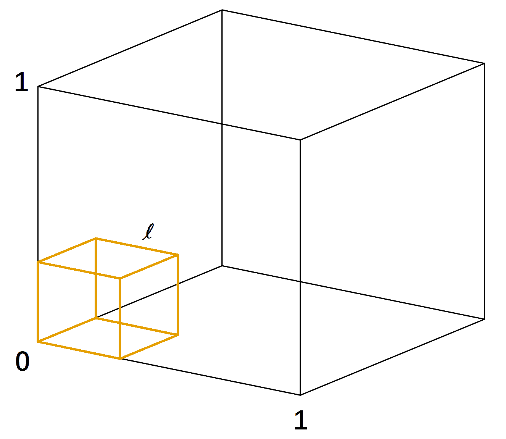

\def\cA{{\cal A}}
\def\cB{{\cal B}}
\def\cC{{\cal C}}
\def\cD{{\cal D}}
\def\cE{{\cal E}}
\def\cF{{\cal F}}
\def\cG{{\cal G}}
\def\cH{{\cal H}}
\def\cI{{\cal I}}
\def\cJ{{\cal J}}
\def\cK{{\cal K}}
\def\cL{{\cal L}}
\def\cM{{\cal M}}
\def\cN{{\cal N}}
\def\cO{{\cal O}}
\def\cP{{\cal P}}
\def\cQ{{\cal Q}}
\def\cR{{\cal R}}
\def\cS{{\cal S}}
\def\cT{{\cal T}}
\def\cU{{\cal U}}
\def\cV{{\cal V}}
\def\cW{{\cal W}}
\def\cX{{\cal X}}
\def\cY{{\cal Y}}
\def\cZ{{\cal Z}}

\def\bA{\mathbf{A}}
\def\bB{\mathbf{B}}
\def\bC{\mathbf{C}}
\def\bD{\mathbf{D}}
\def\bE{\mathbf{E}}
\def\bF{\mathbf{F}}
\def\bG{\mathbf{G}}
\def\bH{\mathbf{H}}
\def\bI{\mathbf{I}}
\def\bJ{\mathbf{J}}
\def\bK{\mathbf{K}}
\def\bL{\mathbf{L}}
\def\bM{\mathbf{M}}
\def\bN{\mathbf{N}}
\def\bO{\mathbf{O}}
\def\bP{\mathbf{P}}
\def\bQ{\mathbf{Q}}
\def\bR{\mathbf{R}}
\def\bS{\mathbf{S}}
\def\bT{\mathbf{T}}
\def\bU{\mathbf{U}}
\def\bV{\mathbf{V}}
\def\bW{\mathbf{W}}
\def\bX{\mathbf{X}}
\def\bY{\mathbf{Y}}
\def\bZ{\mathbf{Z}}

\def\ba{\mathbf{a}}
\def\bb{\mathbf{b}}
\def\bc{\mathbf{c}}
\def\bd{\mathbf{d}}
\def\be{\mathbf{e}}
<!-- Conflict \def\bf{\mathbf{f}} -->
\def\bg{\mathbf{g}}
\def\bh{\mathbf{h}}
\def\bi{\mathbf{i}}
\def\bj{\mathbf{j}}
\def\bk{\mathbf{k}}
\def\bl{\mathbf{l}}
\def\bm{\mathbf{m}}
\def\bn{\mathbf{n}}
\def\bo{\mathbf{o}}
\def\bp{\mathbf{p}}
\def\bq{\mathbf{q}}
\def\br{\mathbf{r}}
\def\bs{\mathbf{s}}
\def\bt{\mathbf{t}}
\def\bu{\mathbf{u}}
\def\bv{\mathbf{v}}
\def\bw{\mathbf{w}}
\def\bx{\mathbf{x}}
\def\by{\mathbf{y}}
\def\bz{\mathbf{z}}

\def\bzero{\mathbf{0}}
\def\balpha{\boldsymbol{\alpha}}
\def\bbeta{\boldsymbol{\beta}}
\def\btheta{\boldsymbol{\theta}}
\def\bxi{\boldsymbol{\xi}}
\def\bmu{\boldsymbol{\mu}}
\def\bepsilon{\boldsymbol{\epsilon}}

\def\T{\text{T}}
\def\Trace{\text{Trace}}
\def\Cov{\text{Cov}}
\def\Var{\text{Var}}
\def\E{\text{E}}
\def\pr{\text{pr}}
\def\Prob{\text{P}}
\def\argmin{\arg\min}
\def\argmax{\arg\max}

```{r include = FALSE}
  options(width = 100)
  knitr::opts_knit$set(global.par = TRUE)
  knitr::opts_chunk$set(collapse = TRUE, fig.dim = c(6, 6),
                        out.width = "45%", fig.align = 'center')
```
```{r include = FALSE}
  par(bg="transparent")
  par(mar=c(2,2,2,2))
  par(mfrow=c(1,1))
```

# K-Neariest Neighber

$K$ nearest neighbor (KNN) is a simple nonparametric method. It can be used for both regression and classification problems. However, the idea is quite different from models we introduced before. In a linear model, we have a set of parameters $\bbeta$ and our estimated function value, for any target point $x_0$ is $x_0^\T \bbeta$. In KNN, we don't really specify these parameters. Instead, we directed estimate $f(x_0)$. This is traditionally called __nonparametric models__ in statistics. Usually these models perform a local averaging technique to estimate $f(x_0)$ using observations close to $x_0$. 

## Definition

Suppose we collect a set of observations $\{x_i, y_i\}_{i=1}^n$, the prediction at a new target point $x_0$ is

$$\widehat y = \frac{1}{k} \sum_{x_i \in N_k(x_0)} y_i,$$
where $N_k(x_0)$ defines the $k$ samples from the training data that are closest to $x_0$. As default, closeness is defined using a distance measure, such as the Euclidean distance. Here is a demonstration of the fitted regression function. 

```{r fig.dim = c(9, 6)}
    # generate training data with 2*sin(x) and random Gaussian errors
    set.seed(1)    
    x <- runif(15, 0, 2*pi)
    y <- 2*sin(x) + rnorm(length(x))
    
    # generate testing data points where we evaluate the prediction function
    test.x = seq(0, 1, 0.001)*2*pi

    # "1-nearest neighbor" regression using kknn package
    library(kknn)
    knn.fit = kknn(y ~ x, train = data.frame(x = x, y = y), 
                   test = data.frame(x = test.x),
                   k = 1, kernel = "rectangular")
    test.pred = knn.fit$fitted.values
    
    # plot the data
    par(mar=rep(2,4))
    plot(x, y, xlim = c(0, 2*pi), pch = "o", cex = 2, 
         xlab = "", ylab = "", cex.lab = 1.5)
    title(main="1-Nearest Neighbor Regression", cex.main = 1.5)
    
    # plot the true regression line
    lines(test.x, 2*sin(test.x), col = "deepskyblue", lwd = 3)
    
    # plot the fitted line
    lines(test.x, test.pred, type = "s", col = "darkorange", lwd = 3)
    legend("topright", c("Fitted line", "True function"), 
           col = c("darkorange", "deepskyblue"), lty = 1, cex = 1.5)
```

## Tuning $k$

Tuning $k$ is crucial for $k$NN. Let's observe its effect. This time, I generate 200 observations. For 1NN, the fitted regression line is very jumpy. 

```{r}
  # generate more data
  set.seed(1)
  n = 200
  x <- runif(n, 0, 2*pi)
  y <- 2*sin(x) + rnorm(length(x))

  test.y = 2*sin(test.x) + rnorm(length(test.x))
  
  # 1-nearest neighbor
  knn.fit = kknn(y ~ x, train = data.frame(x = x, y = y), 
                 test = data.frame(x = test.x),
                 k = 1, kernel = "rectangular")
  test.pred = knn.fit$fitted.values
```

```{r echo = FALSE, fig.dim = c(9, 6)}
  par(mar=rep(2,4))
  plot(x, y, pch = 19, cex = 1, 
       xlim = c(0, 2*pi), ylim = c(-4.25, 4.25))
  title(main="1-Nearest Neighbor Regression", cex.main = 1.5)
  lines(test.x, 2*sin(test.x), col = "deepskyblue", lwd = 3)
  lines(test.x, test.pred, type = "s", col = "darkorange", lwd = 3)
  legend("topright", c("Fitted line", "True function"), 
         col = c("darkorange", "deepskyblue"), lty = 1, cex = 1.5)
```

We can evaluate the prediction error of this model: 

```{r}
  # prediction error
  mean((test.pred - test.y)^2)
```

If we consider different values of $k$, we can observe the trade-off between bias and variance. 

```{r echo = FALSE, fig.dim = c(12, 6), out.width = "90%"}
  par(mfrow=c(2,3))
  par(mar=rep(2,4))
  
  for (k in c(1, 5, 10, 33, 66, 100))
  {
      knn.fit = kknn(y ~ x, train = data.frame(x = x, y = y), 
                     test = data.frame(x = test.x),
                     k = k, kernel = "rectangular")
      test.pred = knn.fit$fitted.values
      cat(paste("Prediction Error for K =", k, ":", mean((test.pred - test.y)^2)))

      plot(x, y, xlim = c(0, 2*pi), pch = 19, cex = 0.7, 
           axes=FALSE, ylim = c(-4.25, 4.25))
      title(main=paste("K =", k))
      lines(test.x, 2*sin(test.x), col = "deepskyblue", lwd = 3)
      lines(test.x, test.pred, type = "s", col = "darkorange", lwd = 3)
      box()
  }
```

As $k$ increases, we have a more stable model, i.e., smaller variance. However, the bias is also increased. As $k$ decreases, the bias decreases, but the model is less stable.

## The Bias-variance Trade-off

Formally, the prediction error (at a given target point $x_0$) can be broke down into three parts: the __irreducible error__, the __bias squared__, and the __variance__.

\begin{aligned}
\E\Big[ \big( Y - \widehat f(x_0) \big)^2 \Big] &= \E \Big[ \big( Y - f(x_0) + f(x_0) -  \E[\widehat f(x_0)] + \E[\widehat f(x_0)] - \widehat f(x_0) \big)^2 \Big] \\
&= \E \Big[ \big( Y - f(x_0) \big)^2 \Big] + \E \Big[ \big(f(x_0) - \E[\widehat f(x_0)] \big)^2 \Big] + \E\Big[ \big(E[\widehat f(x_0)] - \widehat f(x_0) \big)^2 \Big] + \text{Cross Terms}\\
&= \underbrace{\E\Big[ ( Y - f(x_0))^2 \big]}_{\text{Irreducible Error}} +
\underbrace{\Big(f(x_0) - \E[\widehat f(x_0)]\Big)^2}_{\text{Bias}^2} + 
\underbrace{\E\Big[ \big(\widehat f(x_0) - \E[\widehat f(x_0)] \big)^2 \Big]}_{\text{Variance}}
\end{aligned}

As we can see from the previous example, when $k=1$, the prediction error is about 2. This is because for all the testing points, the theoretical irreducible error is 1 (variance of the error term), the bias is almost 0 since the function is smooth, and the variance is the variance of 1 nearest neighbor, which is again 1. On the other extreme side, when $k = n$, the variance should be in the level of $1/n$, the bias is the difference between the sin function and the overall average. Overall, we can expect the trend:

  * As $k$ increases, bias increases and variance decreases
  * As $k$ decreases, bias decreases and variance increases

## KNN for Classification 

For classification, kNN is different from the regression model in term of finding neighbers. The only difference is to majority voting instead of averaging. Majority voting means that we look for the most popular class label among its neighbors. For 1NN, it is simply the class of the closest neighbor. The visualization of 1NN is a Voronoi tessellation. The plot on the left is some randomly observed data in $[0, 1]^2$, and the plot on the right is the corresponding 1NN classification model. 

```{r message=FALSE, fig.dim=c(12, 6), out.width="90%", echo = FALSE}
  # knn for classification: 
  library(class)
  par(mfrow=c(1,2))
  par(mar=rep(2,4))
  
  # generate 20 random observations, with random class 1/0
  set.seed(1)    
  x <- matrix(runif(40), 20, 2)
  g <- rbinom(20, 1, 0.5)

  # plot the data
  plot(x, col=ifelse(g==1, "darkorange", "deepskyblue"), pch = 19, 
       cex = 3, xlim= c(0, 1), ylim = c(0, 1))
  symbols(0.7, 0.7, circles = 0.12, add = TRUE, inches = FALSE)
  points(0.7, 0.7, pch = 4, lwd = 2, col = "red")

  # generate a grid for plot
  xgd1 = xgd2 = seq(0, 1, 0.01)
  gd = expand.grid(xgd1, xgd2)

  # fit a 1-nearest neighbor model and get the fitted class
  knn1 <- knn(x, gd, g, k=1)
  knn1.class <- matrix(knn1, length(xgd1), length(xgd2))

  # Voronoi tessalation plot (1NN)
  library(deldir)
  z <- deldir(x = data.frame(x = x[,1], y = x[,2], z=as.factor(g)), 
              rw = c(0, 1, 0, 1))
  w <- tile.list(z)
  
  plot(w, fillcol=ifelse(g==1, "bisque", "cadetblue1"))
  points(x, col=ifelse(g==1, "darkorange", "deepskyblue"), pch = 19, cex = 3)
  points(0.7, 0.7, pch = 4, lwd = 2, col = "red")
```

```{r echo = FALSE}
  par(mfrow=c(1,1))
```

## Example 1: An artificial data

We use artificial data from the `ElemStatLearn` package. 

```{r fig.dim=c(6, 6), out.width="45%"}
  library(ElemStatLearn)
  
  x <- mixture.example$x
  y <- mixture.example$y
  xnew <- mixture.example$xnew
  
  par(mar=rep(2,4))
  plot(x, col=ifelse(y==1, "darkorange", "deepskyblue"), 
       axes = FALSE, pch = 19)
  box()
```

The decision boundary is highly nonlinear. We can utilize the `contour()` function to demonstrate the result. 

```{r}
  # knn classification 
  k = 15
  knn.fit <- knn(x, xnew, y, k=k)
  
  px1 <- mixture.example$px1
  px2 <- mixture.example$px2
  pred <- matrix(knn.fit == "1", length(px1), length(px2))
  
  contour(px1, px2, pred, levels=0.5, labels="",axes=FALSE)
  box()
  title(paste(k, "-Nearest Neighbor", sep= ""))
  points(x, col=ifelse(y==1, "darkorange", "deepskyblue"), pch = 19)
  mesh <- expand.grid(px1, px2)
  points(mesh, pch=".", cex=1.2, col=ifelse(pred, "darkorange", "deepskyblue"))
```

We can evaluate the in-sample prediction result of this model using a confusion matrix:

```{r message=FALSE}
  # the confusion matrix
  knn.fit <- knn(x, x, y, k = 15)
  xtab = table(knn.fit, y)
  
  library(caret)
  confusionMatrix(xtab)
```

## Degrees of Freedom

From our ridge lecture, we have a definition of the degrees of freedom. For a linear model, the degrees of freedom is $p$. For KNN, we can simply verify this by

\begin{align}
\text{DF}(\widehat{f}) =& \frac{1}{\sigma^2} \sum_{i = 1}^n \Cov(\widehat{y}_i, y_i)\\
=& \frac{1}{\sigma^2} \sum_{i = 1}^n \frac{\sigma^2}{k}\\
=& \frac{n}{k}
\end{align}

## Tuning with the `caret` Package

The `caret` package has some built-in feature that can tune some popular machine learning models using cross-validation. The cross-validation settings need to be specified using the $trainControl()$ function. 

```{r message=FALSE}
  library(caret)
  control <- trainControl(method = "cv", number = 10)
```

There are other cross-validation methods, such as `repeatedcv` the repeats the CV several times, and leave-one-out CV `LOOCV`. For more details, you can read the [documentation](https://www.rdocumentation.org/packages/caret/versions/6.0-88/topics/trainControl). We can then setup the training by specifying a grid of $k$ values, and also the CV setup. Make sure that you specify `method = "knn"` and also construct the outcome as a factor in a data frame. 

```{r echo=FALSE}  
  par(mar=c(4,4,2,2))
```

```{r}  
  set.seed(1)
  knn.cvfit <- train(y ~ ., method = "knn", 
                     data = data.frame("x" = x, "y" = as.factor(y)),
                     tuneGrid = data.frame(k = seq(1, 40, 1)),
                     trControl = control)
  
  plot(knn.cvfit$results$k, 1-knn.cvfit$results$Accuracy,
       xlab = "K", ylab = "Classification Error", type = "b",
       pch = 19, col = "darkorange")
```

Print out the fitted object, we can see that the best $k$ is 6. And there is a clear "U" shaped pattern that shows the potential bias-variance trade-off.

## Distance Measures

Closeness between two points needs to be defined based on some distance measures. By default, we use the squared Euclidean distance ($\ell_2$ norm) for continuous variables:

$$d^2(\bu, \bv) = \lVert \bu - \bv \rVert_2^2 = \sum_{j=1}^p (u_j, v_j)^2.$$
However, this measure is not scale invariant. A variable with large scale can dominate this measure. Hence, we often consider a normalized version:

$$d^2(\bu, \bv) = \sum_{j=1}^p \frac{(u_j, v_j)^2}{\sigma_j^2},$$
where $\sigma_j^2$ can be estimated using the sample variance of variable $j$. Another choice that further taking the covariance structure into consideration is the __Mahalanobis distance__:

$$d^2(\bu, \bv) = (\bu - \bv)^\T \Sigma^{-1} (\bu - \bv),$$
where $\Sigma$ is the covariance matrix, and can be estimated using the sample covariance. In the following plot, the red cross and orange cross have the same Euclidean distance to the center. However, the red cross is more of a "outlier" based on the joint distribution. The Mahalanobis distance would reflect this. 

```{r, message=FALSE}
  x=rnorm(100)
  y=1 + 0.3*x + 0.3*rnorm(100)

  library(car)
  dataEllipse(x, y, levels=c(0.6, 0.9), col = c("black", "deepskyblue"), pch = 19)
  points(1, 0.5, col = "red", pch = 4, cex = 2, lwd = 4)
  points(1, 1.5, col = "darkorange", pch = 4, cex = 3, lwd = 4)
```

For categorical variables, the Hamming distance is commonly used:

$$d(\bu, \bv) = \sum_{j=1}^p I(u_j \neq v_j).$$
It simply counts how many entries are not the same. 


## 1NN Error Bound

We can show that 1NN can achieve reasonable performance for fixed $p$, as $n \rightarrow \infty$ by showing that the 1NN error is no more than twice of the Bayes error, which is the smaller one of $P(Y = 1 | X = x_0)$ and $1 - P(Y = 1 | X = x_0)$. 

Let's denote $x_{1nn}$ the closest neighbor of $x_0$, we have $d(x_0, x_{1nn}) \rightarrow 0$ by the law of large numbers. Assuming smoothness, we have $P(Y = 1 | x_{1nn}) \rightarrow P(Y = 1 | x_0)$. Hence, the 1NN error is the chance we make a wrong prediction, which can happen in two situations. WLOG, let's assume that $P(Y = 1 | X = x_0)$ is larger than $1-P(Y = 1 | X = x_0)$, then 

\begin{align}
& \,P(Y=1|x_0)[ 1 - P(Y=1|x_{1nn})] + P(Y=1|x_0)[ 1 - P(Y=1|x_{1nn})]\\
\leq & \,[ 1 - P(Y=1|x_{1nn})] + [ 1 - P(Y=1|x_{1nn})]\\
\rightarrow & \, 2[ 1 - P(Y=1|x_0)]\\
= & \,2 \times \text{Bayes Error}\\
\end{align}

This is a crude bound, but shows that 1NN can still be a reasonable estimator when the noise is small (Bayes error small). 

## Example 2: Handwritten Digit Data

Let's consider another example using the handwritten digit data. Each observation in this data is a $16 \times 16$ pixel image. Hence, the total number of variables is $256$. At each pixel, we have the gray scale as the numerical value. 

```{r out.width="20%"}
  # Handwritten Digit Recognition Data
  library(ElemStatLearn)
  # the first column is the true digit
  dim(zip.train)
  dim(zip.test)
  
  # look at one sample
  image(zip2image(zip.train, 1), col=gray(256:0/256), zlim=c(0,1), 
        xlab="", ylab="", axes = FALSE)
```

We use 3NN to predict all samples in the testing data. The model is fairly accurate. 
    
```{r}
  # fit 3nn model and calculate the error
  knn.fit <- knn(zip.train[, 2:257], zip.test[, 2:257], zip.train[, 1], k=3)
  
  # overall prediction error
  mean(knn.fit != zip.test[,1])
  
  # the confusion matrix
  table(knn.fit, zip.test[,1])
```

## Curse of Dimensionality

Many of the practical problems we encounter today are high-dimensional. The resolution of the handwritten digit example is $16 \times 16 = 256$. Genetic studies often involves more than 25K gene expressions, etc. For a given sample size $n$, as the number of variables $p$ increases, the data becomes very sparse. Nearest neighbor methods usually do not perform very well on high-dimensional data. This is because for any given target point, there will not be enough training data that lies close enough. To see this, let's consider a $p$-dimensional hyper-cube. Suppose we have $n=1000$ observations uniformly spread out in this cube, and we are interested in predicting a target point with $k=10$ neighbors. If these neighbors are really close to the target point, then this would be a good estimation with small bias. Suppose $p=2$, then we know that if we take a cube (square) with height and width both $l = 0.1$, then there will be $1000 \times 0.1^2 = 10$ observations within the square. In general, we have the relationship 

$$l^p = \frac{k}{n}$$
Try different $p$, we have 

  * If $p = 2$, $l = 0.1$
  * If $p = 10$, $l = 0.63$
  * If $p = 100$, $l = 0.955$

This implies that if we have 100 dimensions, then the nearest 10 observations would be 0.955 away from the target point at each dimension, this is almost at the other corner of the cube. Hence there will be a very large bias. Decreasing $k$ does not help much in this situation since even the closest point can be really far away, and the model would have large variance. 

<center>
{width=30%}
</center>

However, why our model performs well in the handwritten digit example? There is possibly (approximately) a lower dimensional representation of the data so that when you evaluate the distance on the high-dimensional space, it is just as effective as working on the low dimensional space. Dimension reduction is an important topic in statistical learning and machine learning. Many methods, such as sliced inverse regression [@li1991sliced] and UMAP [@mcinnes2018umap] have been developed based on this concept.

<center>
{width=70%}

Image from @cayton2005algorithms.
</center>