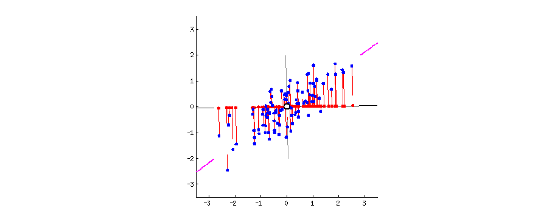

---
output:
  html_document: default
  pdf_document: default
---

```{r setup, include=FALSE}
knitr::opts_chunk$set(echo = TRUE)
knitr::opts_chunk$set(message = FALSE)
options(width = 1000)
```

# Principle Component Analysis

## Basic Concepts

The goal of PCA is to find a direction of data that displays the largest variance. A nice demonstration of this search of direction is provided at this [r-bloggers](https://www.r-bloggers.com/principal-component-analysis-in-r/):



Suppose we have a data matrix with $n$ observations and $p$ variables. Principle Component Analysis (PCA) is always done by centering the variables, i.e., subtract column means from each column of the $n \times p$ data matrix. 

```{r fig.width=5.5, fig.height=3}
    par(mfrow=c(1,2))
    
    # generate some random data from a 2-dimensional normal distribution. 
    library(MASS)
    n = 1000
    Sigma = matrix(c(0.5, -0.65, -0.65, 1), 2, 2)
    x = mvrnorm(n, c(1, 2), Sigma)

    par(mar=c(2, 2, 2, 0.3))
    plot(x, main = "Before Centering", 
         xlim = c(-5, 5), ylim= c(-5, 5), pch = 19, cex = 0.5)
    abline(h = 0, col = "red")
    abline(v = 0, col = "red")
    
    par(mar=c(2, 2, 2, 0.3))
    x = scale(x, scale = FALSE)
    plot(x, main = "After Centering", 
         xlim = c(-5, 5), ylim= c(-5, 5), pch = 19, cex = 0.5)
    abline(h = 0, col = "red")
    abline(v = 0, col = "red")    
```

For our two-dimensional case, we are trying to find a line (direction) on this plain, such that if all points are projected onto this line, their coordinates have the largest variance, compared with any other line.

```{r fig.width=5, fig.height=4.5}
    par(mar=c(2, 2, 0.3, 0.3))
    plot(x, xlim = c(-3.5, 3.5), ylim= c(-3.5, 3.5), pch = 19, cex = 0.5)
    abline(h = 0, col = "red")
    abline(v = 0, col = "red")

    # using pca 
    pc1 = princomp(x)$loadings[,1]
    abline(a = 0, b = pc1[2]/pc1[1], col = "deepskyblue", lwd = 4)
```

We can then take the residuals (after projecting onto this line), and find the largest variance direction of the residuals

```{r fig.width=5, fig.height=4.5, echo = FALSE}
    par(mar=c(2, 2, 0.3, 0.3))
    plot(x, xlim = c(-3.5, 3.5), ylim= c(-3.5, 3.5), pch = 19, cex = 0.5)
    abline(h = 0, col = "red")
    abline(v = 0, col = "red")

    # largest PC 
    pc1 = princomp(x)$loadings[,1]
    abline(a = 0, b = pc1[2]/pc1[1], col = "deepskyblue", lwd = 4)
    # second largest PC
    pc2 = princomp(x)$loadings[,2]
    abline(a = 0, b = pc2[2]/pc2[1], col = "darkorange", lwd = 3)
    
    # From the standard deviations of each principal component, it shows that the first PC has a much larger variation
    
    princomp(x)$sdev
```

We usually visualize the data in these two directions instead of the original covariates. Note that the coordinates on the PC's can be obtained using either the `scores` in the fitted object of `princomp`, or simply multiply the original data matrix by the loadings.

```{r fig.width=5, fig.height=4.5}
    pcafit <- princomp(x)

    # the new coordinates on PC's
    head(pcafit$scores)
    
    # direct calculation based on projection 
    head(x %*% pcafit$loadings)

    # visualize the data on the PCs
    # Note that the both axies are scaled 
    par(mar=c(4, 4.2, 0.3, 0.3))
    plot(pcafit$scores[,1], pcafit$scores[,2], xlab = "First PC", ylab = "Second PC", pch = 19, cex.lab = 1.5)
    abline(h = 0, col = "deepskyblue", lwd = 4)
    abline(v = 0, col = "darkorange", lwd = 4)
```

Note that there are many different functions in `R` that performs PCA. `princomp` and `prcomp` are the most popular ones.

### Note: Scaling

You should always center the variables when performing PCA, however, whether to use scaling (force each variable to have a standard deviation of 1) depends on the particular application. When you have variables that are extremely disproportionate, e.g., age vs. RNA expression, scaling should be used. This is to prevent some variables from dominating the PC loadings due to their large scales. When all the variables are of the similar type, e.g., color intensities of pixels in a figure, it is better to use the original scale. This is because the variables with larger variations may carry more signal. Scaling may lose that information.

## Example 1: `iris` Data

We use the `iris` data again. All four variables are considered in this analysis. We plot the first and second PC directions. 

```{r fig.width=6, fig.height=4.5}
    iris_pc <- prcomp(iris[, 1:4])
    library(ggplot2)
    ggplot(data = data.frame(iris_pc$x), aes(x=PC1, y=PC2)) + 
        geom_point(color=c("chartreuse4", "darkorange", "deepskyblue")[iris$Species], size = 3)
```

One may be interested in plotting all pair-wise direction to see if lower PC's provide useful information. 

```{r fig.width=7, fig.height=6.5}
    pairs(iris_pc$x, col=c("chartreuse4", "darkorange", "deepskyblue")[iris$Species], pch = 19)
```

However, usually, the lower PC's are less informative. This can also be speculated from the eigenvalue plot, which shows how influential each PC is. 

```{r fig.width=5, fig.height=4.5}
    plot(iris_pc, type = "l", pch = 19, main = "Iris PCA eigen-values")
```

Feature contributions to the PC can be accessed through the magnitude of the loadings. This table shows that `Petal.Length` is the most influential variable on the first PC, with loading $\approx 0.8567$. 

```{r}
    iris_pc$rotation
```

We can further visualize this on a plot. This can be helpful when the number of variables is large. 

```{r fig.width=6, fig.height=4}
    features = row.names(iris_pc$rotation)
    ggplot(data = data.frame(iris_pc$rotation), aes(x=PC1, y=PC2, label=features,color=features)) + 
        geom_point(size = 3) + geom_text(size=3)
```

## Example 2: Handwritten Digits

The handwritten zip code digits data contains 7291 training data and 2007 testing data. Each image is a $16 \times 16$-pixel gray-scale image. Hence they are converted to a vector of 256 variables. 

```{r}
    library(ElemStatLearn)
    # Handwritten Digit Recognition Data
    # the first column is the true digit
    dim(zip.train)
```

Here is a sample of some images:

```{r, fig.width=6, fig.height=4, echo = FALSE, results='hide', fig.keep='all'}
    par(mar=c(0.3, 0.3, 0.3, 0.3))
    # a plot of some samples 
    findRows <- function(zip, n) {
    # Find n (random) rows with zip representing 0,1,2,...,9
    res <- vector(length=10, mode="list")
    names(res) <- 0:9
    ind <- zip[,1]
    for (j in 0:9) {
    res[[j+1]] <- sample( which(ind==j), n ) }
    return(res) }

    # Making a plot like that on page 4 of HTF:
    digits <- vector(length=10, mode="list")
    names(digits) <- 0:9
    rows <- findRows(zip.train, 6)
    for (j in 0:9) {
    digits[[j+1]] <- do.call("cbind", lapply(as.list(rows[[j+1]]),
    function(x) zip2image(zip.train, x)) )
    }
    im <- do.call("rbind", digits)
    
    image(im, col=gray(256:0/256), zlim=c(0,1), 
          xaxt="n", yaxt="n", xlab="", ylab="")
```

Let's do a simpler task, using just three letters: 1, 4 and 8. 

```{r, fig.width=6, fig.height=4}
    zip.sub = zip.train[zip.train[,1] %in% c(1,4,8), -1]
    zip.sub.truth = as.factor(zip.train[zip.train[,1] %in% c(1,4,8), 1])
    dim(zip.sub)
    zip_pc = prcomp(zip.sub)
    plot(zip_pc, type = "l", pch = 19, main = "Digits 1, 4, and 8 PCA eigen-values")
```

The eigenvalue results suggest that the first two principal components are much more influential than the rest. A pair-wise PC plot of the first four PC's may further confirm that speculation. 

```{r, fig.width=8, fig.height=6}
    pairs(zip_pc$x[, 1:4], col=c("chartreuse4", "darkorange", "deepskyblue")[zip.sub.truth], pch = 19)
```

Let's look at the first two PCs more closely. Even without knowing the true class (no colors) we can still vaguely see 3 clusters. 

```{r fig.width=5, fig.height=4}
    library(ggplot2)
    ggplot(data = data.frame(zip_pc$x), aes(x=PC1, y=PC2)) + 
        geom_point(size = 2)
```

Finally, let's briefly look at the results of PCA for all 10 different digits. Of course, more PC's are needed for this task. You can also plot other PC's to get more information. 

```{r fig.width=5, fig.height=4}
    library(colorspace)

    zip_pc <- prcomp(zip.train)

    plot(zip_pc, type = "l", pch = 19, main = "All Digits PCA eigen-values")

    ggplot(data = data.frame(prcomp(zip.train)$x), aes(x=PC1, y=PC2)) + 
    geom_point(color = rainbow_hcl(10)[zip.train[,1]+1], size = 1)
```