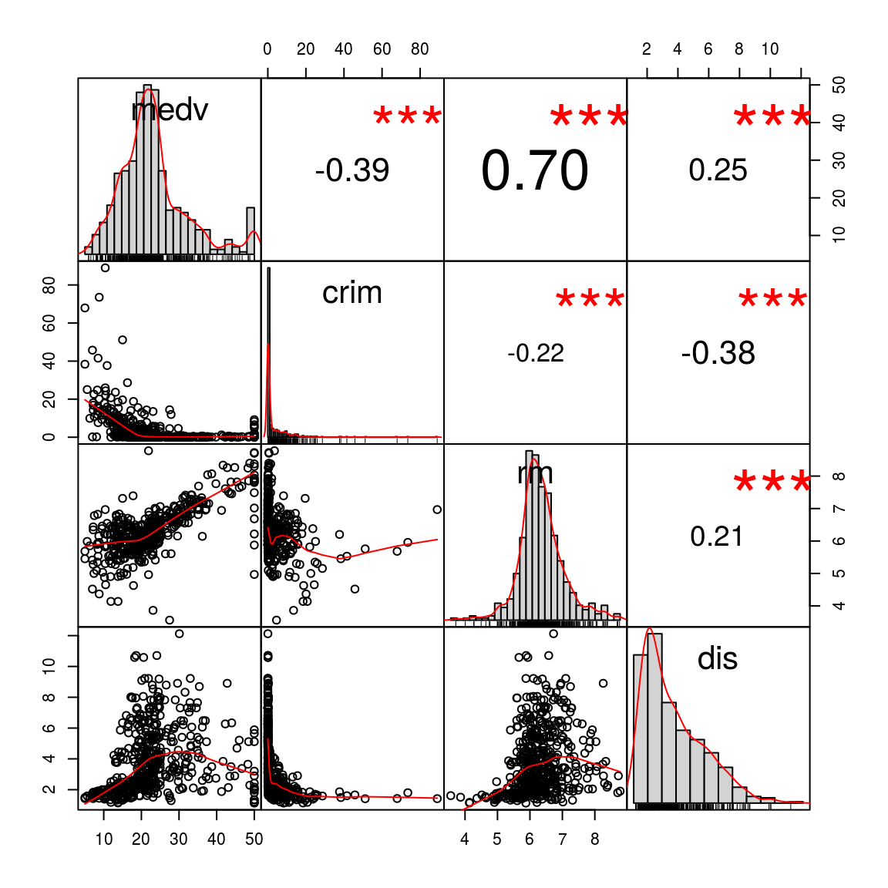
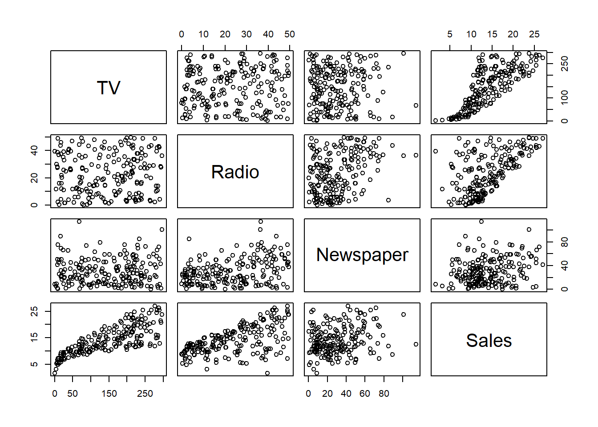
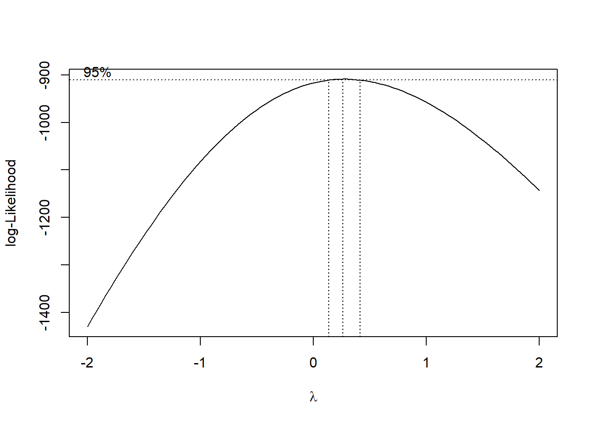

# Modeling Basics in `R`


## Multiple Linear Regression

A simple linear regression assumes the underlying model $$Y = \beta_0 + {\boldsymbol\beta}^\text{T} X + \epsilon.$$ With observed data, we can estimate the regression coefficients. Let's use a classical dataset, the Boston Housing data [@harrison1978hedonic] from the `MASS` package. The goal of this dataset is to model the median house value (`medv`) using other predictors. 

```r
    library(MASS)
    data(Boston)
    # Fit a linear regression using all variables
    fit = lm(medv ~ ., data = Boston)
    summary(fit)
```

```
## 
## Call:
## lm(formula = medv ~ ., data = Boston)
## 
## Residuals:
##     Min      1Q  Median      3Q     Max 
## -15.595  -2.730  -0.518   1.777  26.199 
## 
## Coefficients:
##               Estimate Std. Error t value Pr(>|t|)    
## (Intercept)  3.646e+01  5.103e+00   7.144 3.28e-12 ***
## crim        -1.080e-01  3.286e-02  -3.287 0.001087 ** 
## zn           4.642e-02  1.373e-02   3.382 0.000778 ***
## indus        2.056e-02  6.150e-02   0.334 0.738288    
## chas         2.687e+00  8.616e-01   3.118 0.001925 ** 
## nox         -1.777e+01  3.820e+00  -4.651 4.25e-06 ***
## rm           3.810e+00  4.179e-01   9.116  < 2e-16 ***
## age          6.922e-04  1.321e-02   0.052 0.958229    
## dis         -1.476e+00  1.995e-01  -7.398 6.01e-13 ***
## rad          3.060e-01  6.635e-02   4.613 5.07e-06 ***
## tax         -1.233e-02  3.760e-03  -3.280 0.001112 ** 
## ptratio     -9.527e-01  1.308e-01  -7.283 1.31e-12 ***
## black        9.312e-03  2.686e-03   3.467 0.000573 ***
## lstat       -5.248e-01  5.072e-02 -10.347  < 2e-16 ***
## ---
## Signif. codes:  0 '***' 0.001 '**' 0.01 '*' 0.05 '.' 0.1 ' ' 1
## 
## Residual standard error: 4.745 on 492 degrees of freedom
## Multiple R-squared:  0.7406,	Adjusted R-squared:  0.7338 
## F-statistic: 108.1 on 13 and 492 DF,  p-value: < 2.2e-16
```

The output can be overwhelming for beginers. However, by specifying the model with `medv ~ .`, we are using all varaibles except `medv` as the predictors. And by default, an intercept term is also included. Instead, we could specify particular variables as predictors. For example


```r
    fit = lm(medv ~ rm + ptratio, data = Boston)
    summary(fit)
```

```
## 
## Call:
## lm(formula = medv ~ rm + ptratio, data = Boston)
## 
## Residuals:
##     Min      1Q  Median      3Q     Max 
## -17.672  -2.821   0.102   2.770  39.819 
## 
## Coefficients:
##             Estimate Std. Error t value Pr(>|t|)    
## (Intercept)  -2.5612     4.1889  -0.611    0.541    
## rm            7.7141     0.4136  18.650   <2e-16 ***
## ptratio      -1.2672     0.1342  -9.440   <2e-16 ***
## ---
## Signif. codes:  0 '***' 0.001 '**' 0.01 '*' 0.05 '.' 0.1 ' ' 1
## 
## Residual standard error: 6.104 on 503 degrees of freedom
## Multiple R-squared:  0.5613,	Adjusted R-squared:  0.5595 
## F-statistic: 321.7 on 2 and 503 DF,  p-value: < 2.2e-16
```


**TODO:** Instead of specifically considering regression, change the focus of this chapter to modeling, with regression as an example.

This chapter will recap the basics of performing regression analyses in `R`. For more detailed coverage, see [Applied Statistics with `R`](http://daviddalpiaz.github.io/appliedstats/).

We will use the [Advertising data](data/Advertising.csv) associated with [Introduction to Statistical Learning](http://www-bcf.usc.edu/~gareth/ISL/data.html).


```r
library(readr)
Advertising = read_csv("data/Advertising.csv")
```

After loading data into `R`, our first step should **always** be to inspect the data. We will start by simply printing some observations in order to understand the basic structure of the data.


```r
Advertising
```

```
## # A tibble: 200 x 4
##        TV Radio Newspaper Sales
##     <dbl> <dbl>     <dbl> <dbl>
##  1 230.   37.8      69.2  22.1 
##  2  44.5  39.3      45.1  10.4 
##  3  17.2  45.9      69.3   9.30
##  4 152.   41.3      58.5  18.5 
##  5 181.   10.8      58.4  12.9 
##  6   8.70 48.9      75.0   7.20
##  7  57.5  32.8      23.5  11.8 
##  8 120.   19.6      11.6  13.2 
##  9   8.60  2.10      1.00  4.80
## 10 200.    2.60     21.2  10.6 
## # ... with 190 more rows
```

Because the data was read using `read_csv()`, `Advertising` is a tibble. We see that there are a total of 200 observations and 4 variables, each of which is numeric. (Specifically double-precision vectors, but more importantly they are numbers.) For the purpose of this analysis, `Sales` will be the **response variable**. That is, we seek to understand the relationship between `Sales`, and the **predictor variables**: `TV`, `Radio`, and `Newspaper`.

## Visualization for Regression

After investigating the structure of the data, the next step should be to visualize the data. Since we have only numeric variables, we should consider **scatter plots**.

We could do so for any individual predictor.


```r
plot(Sales ~ TV, data = Advertising, col = "dodgerblue", pch = 20, cex = 1.5,
     main = "Sales vs Television Advertising")
```



The `pairs()` function is a useful way to quickly visualize a number of scatter plots.


```r
pairs(Advertising)
```



Often, we will be most interested in only the relationship between each predictor and the response. For this, we can use the `featurePlot()` function from the `caret` package. (We will use the `caret` package more and more frequently as we introduce new topics.)


```r
library(caret)
featurePlot(x = Advertising[ , c("TV", "Radio", "Newspaper")], y = Advertising$Sales)
```



We see that there is a clear increase in `Sales` as `Radio` or `TV` are increased. The relationship between `Sales` and `Newspaper` is less clear. How all of the predictors work together is also unclear, as there is some obvious correlation between `Radio` and `TV`. To investigate further, we will need to model the data.


## The `lm()` Function {#sec:lm}

The following code fits an additive **linear model** with `Sales` as the response and each remaining variable as a predictor. Note, by not using `attach()` and instead specifying the `data = ` argument, we are able to specify this model without using each of the variable names directly.


```r
mod_1 = lm(Sales ~ ., data = Advertising)
# mod_1 = lm(Sales ~ TV + Radio + Newspaper, data = Advertising)
```

Note that the commented line is equivalent to the line that is run, but we will often use the `response ~ .` syntax when possible.


## Hypothesis Testing

The `summary()` function will return a large amount of useful information about a model fit using `lm()`. Much of it will be helpful for hypothesis testing including individual tests about each predictor, as well as the significance of the regression test.


```r
summary(mod_1)
```

```
## 
## Call:
## lm(formula = Sales ~ ., data = Advertising)
## 
## Residuals:
##     Min      1Q  Median      3Q     Max 
## -8.8277 -0.8908  0.2418  1.1893  2.8292 
## 
## Coefficients:
##              Estimate Std. Error t value Pr(>|t|)    
## (Intercept)  2.938889   0.311908   9.422   <2e-16 ***
## TV           0.045765   0.001395  32.809   <2e-16 ***
## Radio        0.188530   0.008611  21.893   <2e-16 ***
## Newspaper   -0.001037   0.005871  -0.177     0.86    
## ---
## Signif. codes:  0 '***' 0.001 '**' 0.01 '*' 0.05 '.' 0.1 ' ' 1
## 
## Residual standard error: 1.686 on 196 degrees of freedom
## Multiple R-squared:  0.8972,	Adjusted R-squared:  0.8956 
## F-statistic: 570.3 on 3 and 196 DF,  p-value: < 2.2e-16
```


```r
mod_0 = lm(Sales ~ TV + Radio, data = Advertising)
```

The `anova()` function is useful for comparing two models. Here we compare the full additive model, `mod_1`, to a reduced model `mod_0`. Essentially we are testing for the significance of the `Newspaper` variable in the additive model.


```r
anova(mod_0, mod_1)
```

```
## Analysis of Variance Table
## 
## Model 1: Sales ~ TV + Radio
## Model 2: Sales ~ TV + Radio + Newspaper
##   Res.Df    RSS Df Sum of Sq      F Pr(>F)
## 1    197 556.91                           
## 2    196 556.83  1  0.088717 0.0312 0.8599
```

Note that hypothesis testing is *not* our focus, so we omit many details.


## Prediction

The `predict()` function is an extremely versatile function, for, prediction. When used on the result of a model fit using `lm()` it will, by default, return predictions for each of the data points used to fit the model. (Here, we limit the printed result to the first 10.)


```r
head(predict(mod_1), n = 10)
```

```
##         1         2         3         4         5         6         7 
## 20.523974 12.337855 12.307671 17.597830 13.188672 12.478348 11.729760 
##         8         9        10 
## 12.122953  3.727341 12.550849
```

Note that the effect of the `predict()` function is dependent on the input to the function. Here, we are supplying as the first argument a model object of class `lm`. Because of this, `predict()` then runs the `predict.lm()` function. Thus, we should use `?predict.lm()` for details.

We could also specify new data, which should be a data frame or tibble with the same column names as the predictors.


```r
new_obs = data.frame(TV = 150, Radio = 40, Newspaper = 1)
```

We can then use the `predict()` function for point estimates, confidence intervals, and prediction intervals.

Using only the first two arguments, `R` will simply return a point estimate, that is, the "predicted value," $\hat{y}$.


```r
predict(mod_1, newdata = new_obs)
```

```
##        1 
## 17.34375
```

If we specify an additional argument `interval` with a value of `"confidence"`, `R` will return a 95% confidence interval for the mean response at the specified point. Note that here `R` also gives the point estimate as `fit`.


```r
predict(mod_1, newdata = new_obs, interval = "confidence")
```

```
##        fit      lwr      upr
## 1 17.34375 16.77654 17.91096
```

Lastly, we can alter the level using the `level` argument. Here we report a prediction interval instead of a confidence interval.


```r
predict(mod_1, newdata = new_obs, interval = "prediction", level = 0.99)
```

```
##        fit      lwr      upr
## 1 17.34375 12.89612 21.79138
```


## Unusual Observations

`R` provides several functions for obtaining metrics related to unusual observations.

- `resid()` provides the residual for each observation
- `hatvalues()` gives the leverage of each observation
- `rstudent()` give the studentized residual for each observation
- `cooks.distance()` calculates the influence of each observation


```r
head(resid(mod_1), n = 10)
```

```
##           1           2           3           4           5           6 
##  1.57602559 -1.93785482 -3.00767078  0.90217049 -0.28867186 -5.27834763 
##           7           8           9          10 
##  0.07024005  1.07704683  1.07265914 -1.95084872
```

```r
head(hatvalues(mod_1), n = 10)
```

```
##           1           2           3           4           5           6 
## 0.025202848 0.019418228 0.039226158 0.016609666 0.023508833 0.047481074 
##           7           8           9          10 
## 0.014435091 0.009184456 0.030714427 0.017147645
```

```r
head(rstudent(mod_1), n = 10)
```

```
##           1           2           3           4           5           6 
##  0.94680369 -1.16207937 -1.83138947  0.53877383 -0.17288663 -3.28803309 
##           7           8           9          10 
##  0.04186991  0.64099269  0.64544184 -1.16856434
```

```r
head(cooks.distance(mod_1), n = 10)
```

```
##            1            2            3            4            5 
## 5.797287e-03 6.673622e-03 3.382760e-02 1.230165e-03 1.807925e-04 
##            6            7            8            9           10 
## 1.283058e-01 6.452021e-06 9.550237e-04 3.310088e-03 5.945006e-03
```


## Adding Complexity

We have a number of ways to add complexity to a linear model, even allowing a linear model to be used to model non-linear relationships.

### Interactions

Interactions can be introduced to the `lm()` procedure in a number of ways.

We can use the `:` operator to introduce a single interaction of interest.


```r
mod_2 = lm(Sales ~ . + TV:Newspaper, data = Advertising)
coef(mod_2)
```

```
##   (Intercept)            TV         Radio     Newspaper  TV:Newspaper 
##  3.8730824491  0.0392939602  0.1901312252 -0.0320449675  0.0002016962
```

The `response ~ . ^ k` syntax can be used to model all `k`-way interactions. (As well as the appropriate lower order terms.) Here we fit a model with all two-way interactions, and the lower order main effects.


```r
mod_3 = lm(Sales ~ . ^ 2, data = Advertising)
coef(mod_3)
```

```
##     (Intercept)              TV           Radio       Newspaper 
##    6.460158e+00    2.032710e-02    2.292919e-02    1.703394e-02 
##        TV:Radio    TV:Newspaper Radio:Newspaper 
##    1.139280e-03   -7.971435e-05   -1.095976e-04
```

The `*` operator can be used to specify all interactions of a certain order, as well as all lower order terms according to the usual hierarchy. Here we see a three-way interaction and all lower order terms.


```r
mod_4 = lm(Sales ~ TV * Radio * Newspaper, data = Advertising)
coef(mod_4)
```

```
##        (Intercept)                 TV              Radio 
##       6.555887e+00       1.971030e-02       1.962160e-02 
##          Newspaper           TV:Radio       TV:Newspaper 
##       1.310565e-02       1.161523e-03      -5.545501e-05 
##    Radio:Newspaper TV:Radio:Newspaper 
##       9.062944e-06      -7.609955e-07
```

Note that, we have only been dealing with numeric predictors. **Categorical predictors** are often recorded as **factor** variables in `R`. 


```r
library(tibble)
cat_pred = tibble(
  x1 = factor(c(rep("A", 10), rep("B", 10), rep("C", 10))),
  x2 = runif(n = 30),
  y  = rnorm(n = 30)
)
cat_pred
```

```
## # A tibble: 30 x 3
##    x1       x2      y
##    <fct> <dbl>  <dbl>
##  1 A     0.755 -1.95 
##  2 A     0.928 -2.20 
##  3 A     0.431 -2.80 
##  4 A     0.236  3.05 
##  5 A     0.915 -0.675
##  6 A     0.551  1.76 
##  7 A     0.171  1.80 
##  8 A     0.486  0.538
##  9 A     0.983  0.484
## 10 A     0.335  1.61 
## # ... with 20 more rows
```

Notice that in this simple simulated tibble, we have coerced `x1` to be a factor variable, although this is not strictly necessary since the variable took values `A`, `B`, and `C`. When using `lm()`, even if not a factor, `R` would have treated `x1` as such. Coercion to factor is more important if a categorical variable is coded for example as `1`, `2` and `3`. Otherwise it is treated as numeric, which creates a difference in the regression model.

The following two models illustrate the effect of factor variables on linear models.


```r
cat_pred_mod_add = lm(y ~ x1 + x2, data = cat_pred)
coef(cat_pred_mod_add)
```

```
## (Intercept)         x1B         x1C          x2 
##   0.8336990  -0.5266801  -0.3297051  -1.1587417
```


```r
cat_pred_mod_int = lm(y ~ x1 * x2, data = cat_pred)
coef(cat_pred_mod_int)
```

```
## (Intercept)         x1B         x1C          x2      x1B:x2      x1C:x2 
##    2.325505   -2.914192   -1.797805   -3.734849    4.189271    2.508936
```


### Polynomials

Polynomial terms can be specified using the inhibit function `I()` or through the `poly()` function. Note that these two methods produce different coefficients, but the same residuals! This is due to the `poly()` function using orthogonal polynomials by default.


```r
mod_5 = lm(Sales ~ TV + I(TV ^ 2), data = Advertising)
coef(mod_5)
```

```
##   (Intercept)            TV       I(TV^2) 
##  6.114120e+00  6.726593e-02 -6.846934e-05
```

```r
mod_6 = lm(Sales ~ poly(TV, degree = 2), data = Advertising)
coef(mod_6)
```

```
##           (Intercept) poly(TV, degree = 2)1 poly(TV, degree = 2)2 
##             14.022500             57.572721             -6.228802
```

```r
all.equal(resid(mod_5), resid(mod_6))
```

```
## [1] TRUE
```

Polynomials and interactions can be mixed to create even more complex models.


```r
mod_7 = lm(Sales ~ . ^ 2 + poly(TV, degree = 3), data = Advertising)
# mod_7 = lm(Sales ~ . ^ 2 + I(TV ^ 2) + I(TV ^ 3), data = Advertising)
coef(mod_7)
```

```
##           (Intercept)                    TV                 Radio 
##          6.206394e+00          2.092726e-02          3.766579e-02 
##             Newspaper poly(TV, degree = 3)1 poly(TV, degree = 3)2 
##          1.405289e-02                    NA         -9.925605e+00 
## poly(TV, degree = 3)3              TV:Radio          TV:Newspaper 
##          5.309590e+00          1.082074e-03         -5.690107e-05 
##       Radio:Newspaper 
##         -9.924992e-05
```

Notice here that `R` ignores the first order term from `poly(TV, degree = 3)` as it is already in the model. We could consider using the commented line instead.


### Transformations

Note that we could also create more complex models, which allow for non-linearity, using transformations. Be aware, when doing so to the response variable, that this will affect the units of said variable. You may need to un-transform to compare to non-transformed models.


```r
mod_8 = lm(log(Sales) ~ ., data = Advertising)
sqrt(mean(resid(mod_8) ^ 2)) # incorrect RMSE for Model 8
```

```
## [1] 0.1849483
```

```r
sqrt(mean(resid(mod_7) ^ 2)) # RMSE for Model 7
```

```
## [1] 0.4813215
```

```r
sqrt(mean(exp(resid(mod_8)) ^ 2)) # correct RMSE for Model 8
```

```
## [1] 1.023205
```

## `rmarkdown`

The `rmarkdown` file for this chapter can be found [**here**](04-model-basics.Rmd). The file was created using `R` version 3.4.4. The following packages (and their dependencies) were loaded in this file:


```
## [1] "tibble"        "caret"         "ggplot2"       "lattice"      
## [5] "readr"         "MASS"          "ElemStatLearn"
```
