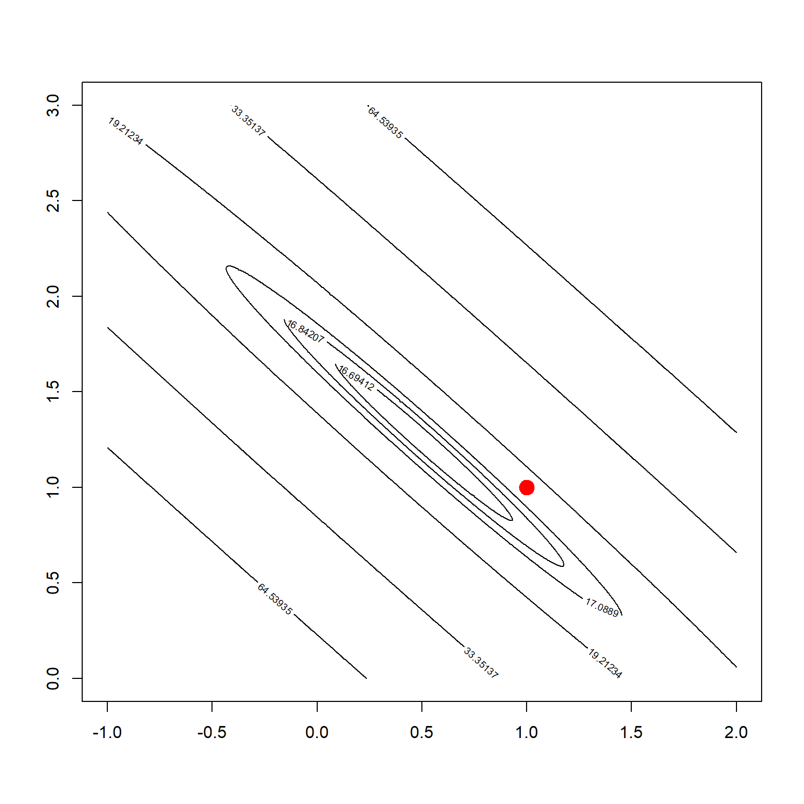
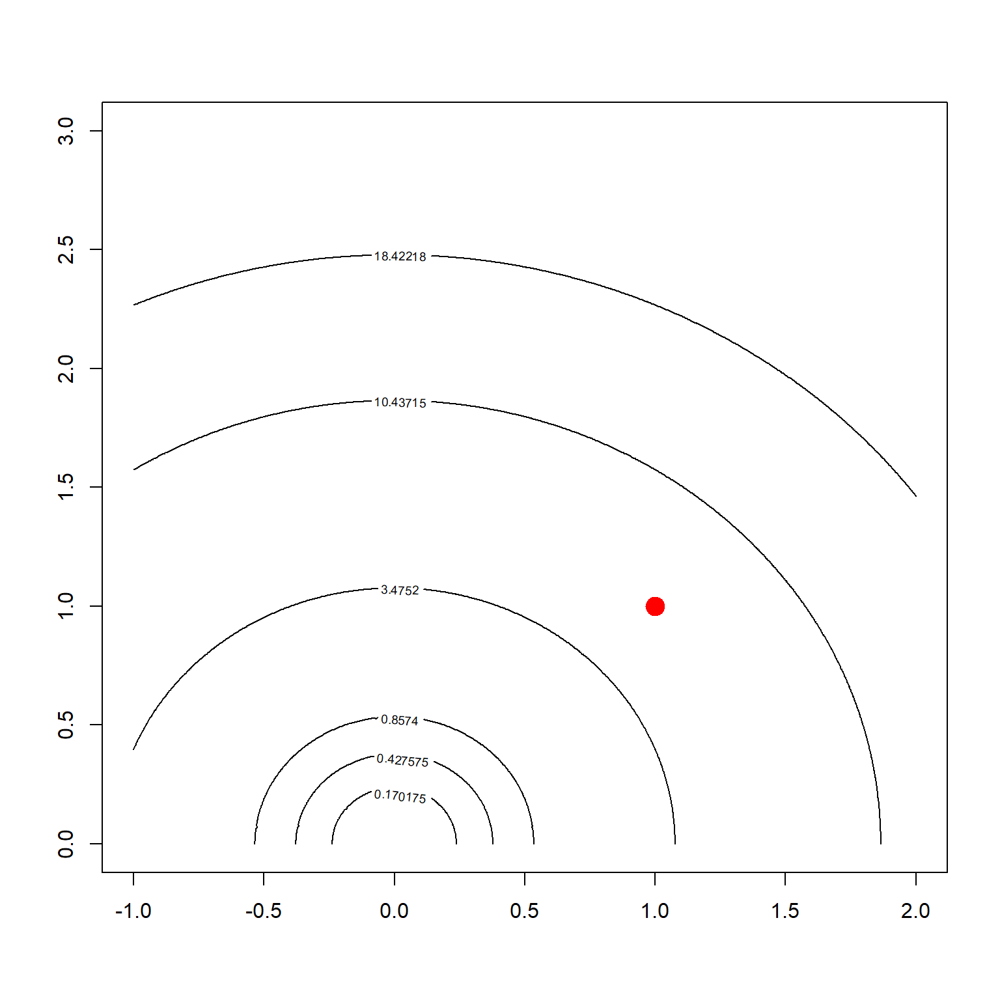
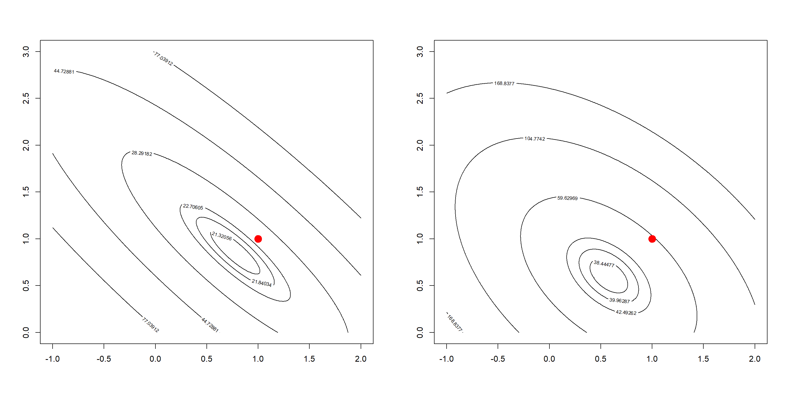
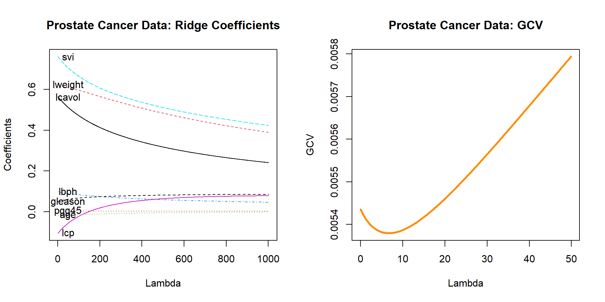
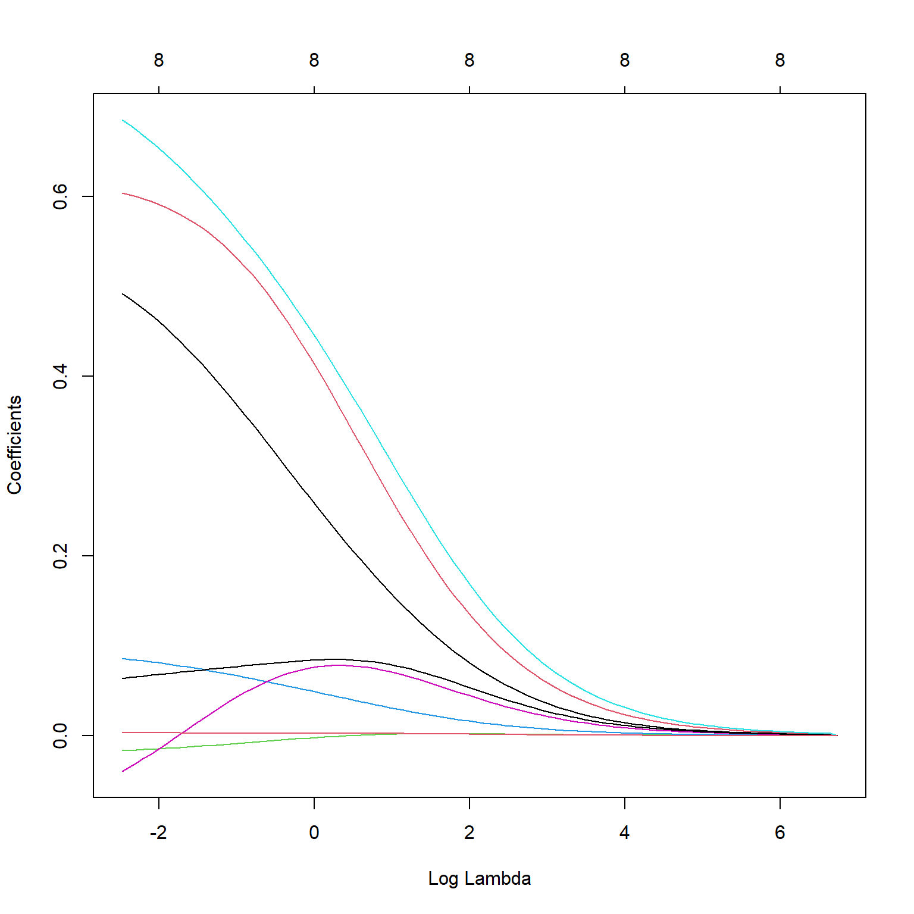

# Ridge Regression

\newcommand{\bbeta}[0]{{\boldsymbol\beta}}
\newcommand{\bX}[0]{\mathbf X}
\newcommand{\bI}[0]{\mathbf I}
\newcommand{\by}[0]{\mathbf y}
\newcommand{\T}[0]{\text{T}}

## Basic Concepts

Ridge regression solves the following $\ell_2$ penalized linear model 

$$\widehat \bbeta^{\,\text{ridge}} = \underset{\bbeta}{\arg\min} \,\, \lVert \by - \bX \bbeta \rVert^2 + \lambda \lVert \bbeta \rVert^2$$

The solution can be obtained through 

$$\bbeta = \big(\bX^\T \bX + \lambda \bI\big)^{-1} \bX^\T \by $$

### Correlated Variables and Convexity

Ridge regression has many advantages. Most notably, it can address highly correlated variables. 


```r
    library(MASS)
    set.seed(3)
    n = 30
    
    # create highly correlated variables and a linear model
    X = mvrnorm(n, c(0, 0), matrix(c(1,0.99, 0.99, 1), 2,2))
    y = rnorm(n, mean = X[,1] + X[,2])
    
    # compare parameter estimates
    summary(lm(y~X-1))$coef
```

```
##     Estimate Std. Error   t value  Pr(>|t|)
## X1 0.5101168   1.034108 0.4932918 0.6256534
## X2 1.2377013   1.009635 1.2258902 0.2304509
```

```r
    # note that the true parameters are all 1's
    lm.ridge(y~X-1, lambda=5)
```

```
##        X1        X2 
## 0.7911361 0.8289581
```

We can note that the variance of both $\beta_1$ and $\beta_2$ are extremely large. This can also be visualized through an optimization point of view. The objective function for an OLS estimator is demonstrated in the following.


```r
    beta1 <- seq(-1, 2, 0.005)
    beta2 <- seq(0, 3, 0.005)
    allbeta <- data.matrix(expand.grid(beta1, beta2))
    rss <- matrix(apply(allbeta, 1, function(b, X, y) sum((y - X %*% b)^2), X, y), 
                  length(beta1), length(beta2))
    
    # quantile levels for drawing contour
    quanlvl = c(0.01, 0.025, 0.05, 0.2, 0.5, 0.75)
    
    # plot the contour
    contour(beta1, beta2, rss, levels = quantile(rss, quanlvl))
    box()
    
    # the truth
    points(1, 1, pch = 19, col = "red", cex = 2)
```



As an alternative, if we add a ridge regression penalty, the contour is forced to be more convex due to the added eigenvalues. Here is a plot of the Ridge $\ell_2$ penalty.


```r
    pen <- matrix(apply(allbeta, 1, function(b) 3*b %*% b),
                  length(beta1), length(beta2))
    
    contour(beta1, beta2, pen, levels = quantile(pen, quanlvl))
    points(1, 1, pch = 19, col = "red", cex = 2)
    box()
```



Hence, by adding this to the OLS objective function, the solution is more stable. This may be interpreted in several different ways such as: 1) the objective function is more convex; 2) the variance of the estimator is smaller. However, this causes some bias too. Choosing the tuning parameter is again a balance of the bias-variance trade-off. 


```r
    par(mfrow=c(1, 2))    

    # adding a L2 penalty to the objective function
    rss <- matrix(apply(allbeta, 1, function(b, X, y) sum((y - X %*% b)^2) + 3*b %*% b, X, y),
                  length(beta1), length(beta2))
    
    contour(beta1, beta2, rss, levels = quantile(rss, quanlvl))
    points(1, 1, pch = 19, col = "red", cex = 2)
    box()
    
    # adding a larger penalty
    rss <- matrix(apply(allbeta, 1, function(b, X, y) sum((y - X %*% b)^2) + 20*b %*% b, X, y),
                  length(beta1), length(beta2))
    contour(beta1, beta2, rss, levels = quantile(rss, quanlvl))
    points(1, 1, pch = 19, col = "red", cex = 2)
    box()
```



### Example 1: The Prostate Cancer Data

We use the prostate cancer data `prostate` from the `ElemStatLearn` package. The dataset contains 8 explanatory variables and one outcome `lpsa`, the log prostate-specific antigen value. 


```r
    library(ElemStatLearn)
    head(prostate)
```

```
##       lcavol  lweight age      lbph svi       lcp gleason pgg45       lpsa train
## 1 -0.5798185 2.769459  50 -1.386294   0 -1.386294       6     0 -0.4307829  TRUE
## 2 -0.9942523 3.319626  58 -1.386294   0 -1.386294       6     0 -0.1625189  TRUE
## 3 -0.5108256 2.691243  74 -1.386294   0 -1.386294       7    20 -0.1625189  TRUE
## 4 -1.2039728 3.282789  58 -1.386294   0 -1.386294       6     0 -0.1625189  TRUE
## 5  0.7514161 3.432373  62 -1.386294   0 -1.386294       6     0  0.3715636  TRUE
## 6 -1.0498221 3.228826  50 -1.386294   0 -1.386294       6     0  0.7654678  TRUE
```

We fit a ridge regression on a grid of $\lambda$ values. For each $\lambda$, the coefficients of all variables are recorded. The left plot shows how these coefficients change as a function of $\lambda$ We can easily see that as $\lambda$ becomes larger, the coefficients are shrunken towards 0. To select the best $\lambda$ value, we use the GCV (generalized cross-validation) criteria. The right plot shows how GCV changes as a function of $\lambda$. Becareful that the coefficients of the fitted objects `fit$coef` are scaled by the standard deviation of the covariates. If you need the original scale, use `coef(fit)`.


```r
    fit = lm.ridge(lpsa~., prostate[, -10], lambda=seq(0,100,by=0.1))
    
    par(mfrow=c(1,2))
    matplot(coef(fit)[, -1], type = "l", xlab = "Lambda", ylab = "Coefficients")
    text(rep(50, 8), coef(fit)[1,-1], colnames(prostate)[1:8])
    title("Prostate Cancer Data: Ridge Coefficients")
    
    # use GCV to select the best lambda
    plot(fit$lambda[1:500], fit$GCV[1:500], type = "l", col = "darkorange", 
         ylab = "GCV", xlab = "Lambda", lwd = 3)
    title("Prostate Cancer Data: GCV")
```



We select the best $\lambda$ that produces the smallest GCV. 


```r
    fit$lambda[which.min(fit$GCV)]
```

```
## [1] 6.7
```

```r
    round(coef(fit)[which.min(fit$GCV), ], 4)
```

```
##          lcavol lweight     age    lbph     svi     lcp gleason   pgg45 
##  0.0185  0.4957  0.6053 -0.0170  0.0864  0.6893 -0.0427  0.0632  0.0035
```

An alternative approach of selecting the best $\lambda$ is using cross-validation. This can be done using the `glmnet` package. Note that for ridge regression, we need to specify `alpha = 0`.


```r
    library(glmnet)
    set.seed(3)
    fit2 = cv.glmnet(data.matrix(prostate[, 1:8]), prostate$lpsa, nfolds = 10, alpha = 0)
    coef(fit2, s = "lambda.min")
```

```
## 9 x 1 sparse Matrix of class "dgCMatrix"
##                        1
## (Intercept)  0.011566730
## lcavol       0.492211875
## lweight      0.604155671
## age         -0.016727236
## lbph         0.085820464
## svi          0.685477645
## lcp         -0.039717080
## gleason      0.063806235
## pgg45        0.003411982
```

```r
    plot(fit2$glmnet.fit, "lambda")
```


